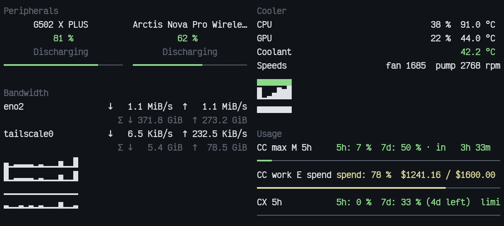
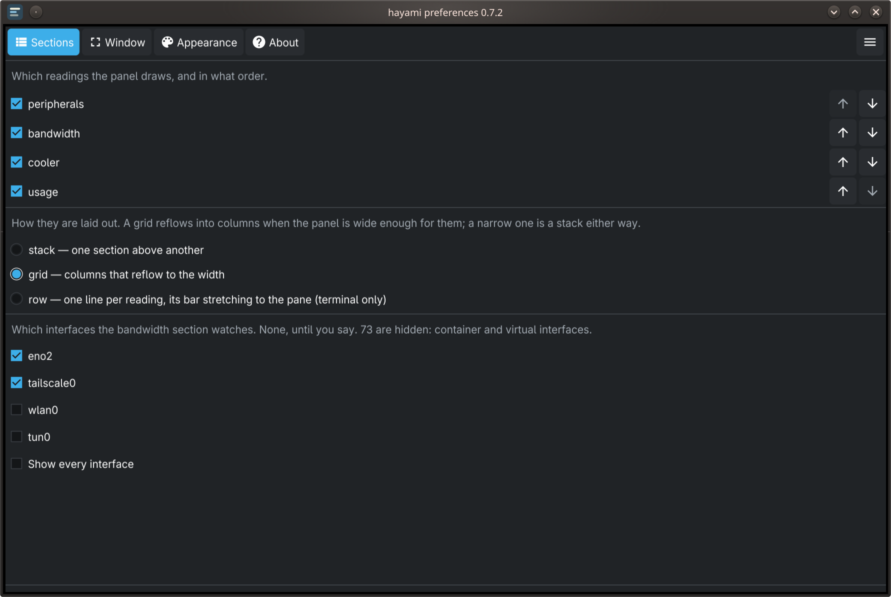
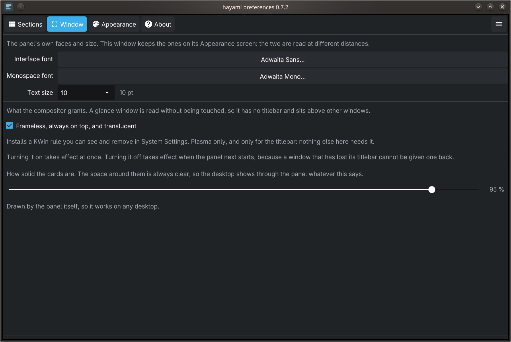
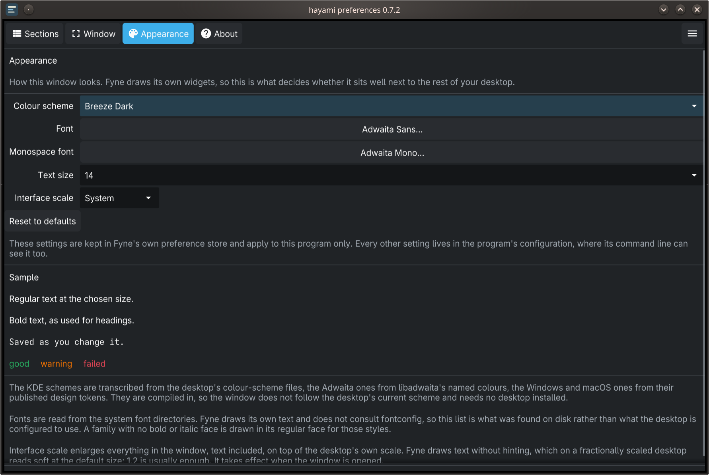
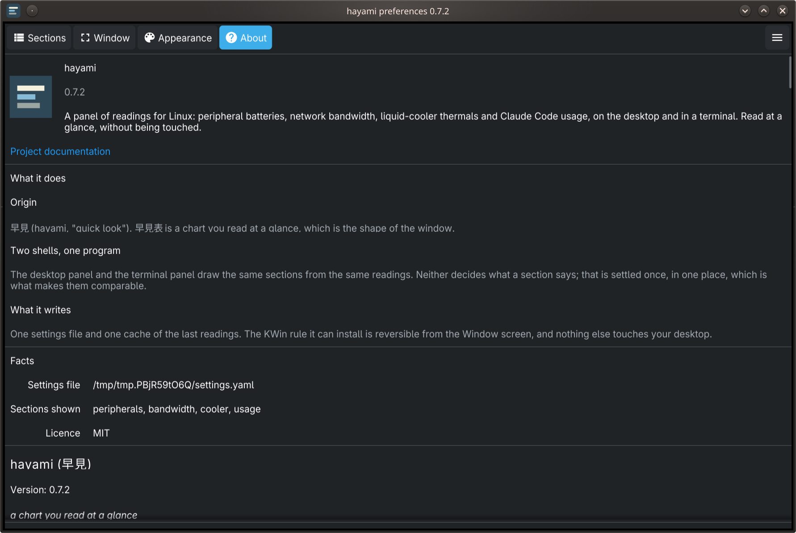

# hayami (早見)

**Version**: 0.9.8

*a chart you read at a glance*

hayami is a small panel that shows, at a glance, four things about your desk:
the battery of your mouse, keyboard and headset, your network traffic, your
processor's, graphics card's and liquid cooler's temperatures, and how much of
your Claude Code and Codex allowance you have used. It runs as a frameless
window that stays on top of the desktop, and as a pane in a terminal. It runs
on Linux and on Windows; what differs between them is in
[Platform notes](#platform-notes).

The name means "quick look": a 早見表 is a chart read at a glance. hayami
replaces two Python programs, `peripheral-battery-monitor` and
`claude-usage-widget-windows`, and shares the usage cache with them while
they are still installed.

## Contents

- [The four sections](#the-four-sections)
- [Screenshots](#screenshots)
- [Installing](#installing)
- [Running it](#running-it)
- [Preferences and settings](#preferences-and-settings)
- [Platform notes](#platform-notes)
- [Architecture](#architecture)
- [Development](#development)
- [Credits](#credits)
- [Licence](#licence)
- [Changelog](#changelog)

## The four sections

Each reading is a **section**. A section is drawn only when it has something
to show, and you choose which sections appear and in what order. A hidden
section is not polled at all.

| Section | What it shows | Where it reads from |
|---|---|---|
| Peripherals | Battery level and charging state of mice, keyboards, headsets and game controllers, a cell per kind of device | [sanshoku](https://github.com/ushineko/sanshoku): Logitech HID++ (including devices behind a receiver), Razer (including the Basilisk Ultimate on its dongle or its cable), SteelSeries, the AULA F75 through its 2.4 GHz receiver, the DualSense over USB or Bluetooth, Bluetooth headsets and other devices through BlueZ on Linux and Windows' own Bluetooth battery level on Windows, AirPods on Linux |
| Bandwidth | Download and upload rate and totals per interface, with a two-minute trend. A Wi-Fi interface also shows its signal, band, channel and link rate | `/proc/net/dev` and nl80211 on Linux; the interface table and the WLAN service on Windows. The network's name is never read |
| Cooler | Processor and graphics card load and temperature, and a liquid cooler's coolant temperature, fan and pump speeds, with a five-minute trend | hwmon by label, `/proc/stat` and the NZXT Kraken's status report on Linux; on Windows, the system's load counters, D3DKMT and the `GPU Engine` counters, and LibreHardwareMonitor for the processor's temperature. `nvidia-smi` only for what those leave out |
| Usage | One meter per account with the percentage used and when it resets, `CC` for Claude Code and `CX` for Codex | The Anthropic OAuth API and the Codex app-server, through a cache shared with the Python tools |

The sections can be laid out three ways, in either panel:

- **stack**: one card above another.
- **grid**: columns that reflow to the width, as in `btop`.
- **row**: one full-width line per reading, its bar stretching across. In the
  window, row has no card headings and no trend plots.

A usage reading that is more than five minutes old stays on screen and is
marked stale: dim in the terminal, with its age in the window's hover note.

## Screenshots

Taken by `make screenshots` from live readings on a Linux desk.

The desktop panel, in the Breeze Dark scheme:


The terminal panel in a 100-column pane, where the grid makes two columns:



The same readings at 160 columns in the row arrangement:


The preferences window:









## Installing

### On Linux

From a [release](https://github.com/ushineko/hayami/releases), which has both
programs built for linux-amd64:

```
tar xzf hayami-<version>-linux-amd64.tar.gz
cd hayami-<version>-linux-amd64
./install.sh
```

This needs no Go or C toolchain. The desktop panel links the system's OpenGL
and X11 or Wayland libraries, so it needs a glibc at least as new as the one
it was built against. If it does not start, build from a checkout instead.

From a checkout, which builds first:

```
./install.sh                # both programs, a launcher entry and an icon
./install.sh --autostart    # and start the panel when you log in
./install.sh --dry-run      # show what it would do, change nothing
./uninstall.sh              # remove those, keeping your settings
```

Everything goes under `~/.local`, and running it again is safe. Two things
are not installed automatically: the [udev rule](#the-udev-rule), which needs
root, and the [KWin rule](#kwin-and-the-window) that removes the titlebar.

The installer leaves `peripheral-battery-monitor` alone; the two can run side
by side. To switch over:

```
rm ~/.config/autostart/peripheral-battery-monitor.desktop   # stop it at login
pkill -f peripheral-battery.py                              # stop it now
./install.sh --autostart                                    # start hayami at login
```

### On Windows

From a checkout, in PowerShell. The build needs Go and an x86_64 mingw gcc
(`winget install --id BrechtSanders.WinLibs.POSIX.UCRT -e`); the script uses a
gcc on `PATH`, or finds the one winget installed.

```
.\scripts\install_windows.ps1               # both programs and a Start menu shortcut
.\scripts\install_windows.ps1 -Autostart    # and start the panel when you log in
.\scripts\install_windows.ps1 -WithSensors  # and LibreHardwareMonitor, for the CPU temperature
.\scripts\install_windows.ps1 -DryRun       # show what it would do, change nothing
.\scripts\uninstall_windows.ps1             # remove those, keeping your settings
```

Everything is per user, under `%LOCALAPPDATA%\Programs\hayami`: no
administrator rights, no registry writes, no `PATH` changes. The programs
carry hayami's icon and version, which the Start menu and a file's Properties
show. Installing over a running panel works: Windows renames the running copy
to `<name>.old`, it keeps running until restarted, and the next install
removes it.

## Running it

```
hayami                                    # the desktop panel
hayami --preferences                      # its preferences window
hayami --preferences=about                # opened on one page
hayami-tui                                # the terminal panel
hayami-tui --sections usage --arrangement row
hayami-tui --once                         # one frame, for a prompt or status line
hayami-tui readings                       # the readings as JSON, no display needed
hayami-tui doctor                         # what each section found, and why not
hayami-tui arrangements                   # the values --arrangement takes
```

`--sections` and `--arrangement` apply to that run only and never write to the
settings file, so a terminal pane can show one section in a row while the
desktop panel shows all four. `hayami-tui --sections usage --arrangement row`
is what replaces `claude-usage-widget-windows`'s `--tui` and `--line` panes.
The desktop panel takes neither flag; it follows its settings.

On Linux, move the panel as any frameless window (Alt-drag on KDE). On
Windows, drag it from anywhere on it, and it opens where you left it.
Right-click it for Preferences, Opacity and Quit.

## Preferences and settings

The preferences window has four pages:

- **Sections**: which sections show, their order (the panel follows at once),
  the arrangement, and which network interfaces the bandwidth section watches.
- **Window**: the panel's fonts and text size, how opaque its cards are, the
  KWin rule on Linux, and on Windows whether it hides for a full-screen app.
- **Appearance**: the preferences window's own colour scheme, fonts and scale.
- **About**: the version, where files live, and this README.

The terminal panel reads the same settings and picks up a change within two
seconds.

Settings live in `~/.config/hayami/settings.yaml` on Linux and
`%APPDATA%\hayami\settings.yaml` on Windows. A setting that belongs to one
section is kept under that section's name:

```yaml
hayami:
    sections:
        - peripherals
        - bandwidth
        - cooler
        - usage
    arrangement: stack
    sectionSettings:
        bandwidth:
            interfaces:
                - eno2
        cooler:
            lhm: http://127.0.0.1:8085/data.json
```

Files from before 0.9.0, with `interfaces` and `lhm` directly under `hayami:`,
are still read, and both shapes are written.

No interface is watched until you choose one. The preferences list the real
interfaces first and keep virtual ones (container bridges, loopback, tunnels)
behind "Show every interface".

The last reading of each section is kept in `sections.json`, under
`~/.cache/hayami` on Linux and `%LOCALAPPDATA%\hayami` on Windows, so a panel
that has just started shows what it last knew, dimmed, until a live reading
arrives. Readings older than a day are ignored, and deleting the file is safe.

The usage cache is shared with the Python tools: `~/.cache/claude-usage-widget`
on Linux, `%LOCALAPPDATA%\claude-usage-widget\cache` on Windows.

## Platform notes

### Windows

- **The window needs no rule.** It has no titlebar, stays on top and is
  translucent on its own. It snaps to screen edges when dragged. If no monitor
  covers the place it was left, it opens where Windows puts it.
- **It hides for a full-screen app.** While the window in front covers the
  whole of the panel's monitor (a browser in full screen, a game in borderless
  full screen) the panel hides, and it comes back without taking the focus. A
  maximised window does not count, nor does a full-screen app on another
  monitor. Turn it off in Preferences, Window.
- **Peripherals** read through Windows' own HID driver, with no vendor
  software and no administrator rights. Confirmed on Windows: Logitech HID++
  devices, the Razer Basilisk Ultimate on its dongle and its cable, and the
  AULA F75 through its receiver. SteelSeries devices and a Logitech Unifying
  keyboard such as the K800 are expected to work and are not yet confirmed.
  A Bluetooth headset paired to Windows is read at the battery level Windows
  shows for it (confirmed: a Bose QC35); it is listed while it is connected.
  AirPods' per-ear levels are read on Linux only, and a headset paired
  through a USB Bluetooth transmitter such as the UGREEN BT701 reports
  neither battery nor connection.
- **Cooler**: the processor's load and name come from the system, and the
  graphics card's temperature, load and name from D3DKMT and the `GPU Engine`
  counters, Task Manager's sources, for any vendor. The load is the busiest
  engine, as Task Manager shows it, so it reads lower than `nvidia-smi`. The
  NZXT Kraken is read on Linux only.
- **Bandwidth** offers the interfaces Network Connections shows; loopback,
  the `Local Area Connection*` adapters and IPv6 transition tunnels are behind
  "Show every interface".

#### The processor's temperature: LibreHardwareMonitor

Windows gives a processor's temperature only to a kernel driver, and hayami
loads none.
[LibreHardwareMonitor](https://github.com/LibreHardwareMonitor/LibreHardwareMonitor)
does, through its PawnIO driver, and serves its readings from a small web
server; hayami reads `http://127.0.0.1:8085/data.json`. It is optional.
Without it the processor's row shows the load only, and the hover note and
`doctor` say why.

`install_windows.ps1 -WithSensors` installs and configures it, skipping any
step already done, and then checks that a temperature is served. Windows asks
for administrator rights once. To do the same by hand:

1. `winget install --id LibreHardwareMonitor.LibreHardwareMonitor -e`
2. Run it as administrator and accept the PawnIO driver it offers on first
   start.
3. **Options > Remote Web Server > Run**, port 8085, no authentication
   (hayami sends no password).
4. **Options > Minimize On Close**, **Start Minimized** and **Minimize To
   Tray**. Without Minimize On Close, closing its window quits it and the
   temperature goes with it.
5. **Options > Run On Windows Startup**, which starts it at logon with
   administrator rights and no UAC prompt.

The script changes only these settings, and keeps the original file as
`LibreHardwareMonitor.config.bak-hayami`. `uninstall_windows.ps1` leaves
LibreHardwareMonitor in place and prints the commands that remove it. For
another port, set `sectionSettings.cooler.lhm` in the settings file.

**Keep port 8085 blocked in Windows Firewall.** LibreHardwareMonitor's web
server listens on every network interface, whatever address it is given, and
the same server accepts requests that change fan settings. Windows Firewall
blocks inbound connections by default; add no rule that allows this port.
hayami only reads `data.json`.

#### Wi-Fi details and location access

Since Windows 11 24H2 the WLAN service describes the connection only to
desktop apps allowed location access, because the access point's address can
locate the machine. To see signal, band, channel and link rate, turn on
Settings, Privacy & security, Location, "Let desktop apps access your
location". Without it the Wi-Fi row shows what it can, and the hover note and
`doctor` say why the rest is blank.

### Linux

#### The udev rule

hayami opens the receivers, headset base stations and cooler on your desk
itself, as you. A device node is yours to open only when a udev rule grants
it to the logged-in user; without one, the card says the device is *not
permitted*. `packaging/60-sanshoku.rules` is that rule, matched by vendor:
Logitech, SteelSeries, Razer, NZXT and the AULA F75's receiver. Bluetooth
needs no rule.

The installer copies it to `/etc/udev/rules.d` when it can, and otherwise
prints the commands:

```
sudo install -m644 packaging/60-sanshoku.rules /etc/udev/rules.d/60-sanshoku.rules
sudo udevadm control --reload
```

Then replug the device, or reboot. `hayami-tui doctor` names any device it may
not open. `uninstall.sh` removes the rule it installed, or prints the commands
to.

#### KWin and the window

hayami draws its own translucency: the gaps between cards are not painted,
and the cards fade to the opacity you set. Only the compositor can remove the
titlebar, so on KDE Plasma hayami installs a KWin rule when you ask, from
Preferences, Window, or with `hayami window install` (`hayami window status`
and `hayami window remove` check and undo it). Without the rule the panel has
a titlebar. KWin already places an active full-screen window over the panel,
so the Windows hide-for-full-screen option is not needed there.

#### Not yet confirmed on Linux

Recent work was tested on Windows. On Linux, these have not yet been checked
on hardware: the AULA F75, the Wi-Fi row through nl80211, and KWin covering
the panel for a full-screen app.

## Architecture

Two programs share one core. `cmd/hayami` is the desktop panel (Fyne) and
`cmd/hayami-tui` the terminal panel (Bubble Tea, built without cgo).
`internal/core` produces each reading as plain data with no toolkit,
`internal/view` describes a section, and each panel only arranges it. Devices
are read through [sanshoku](https://github.com/ushineko/sanshoku). The window
is a glance window from [fynedesygn](https://github.com/ushineko/fynedesygn).
The layers, the rules a change is held to, and where to add a device, reading
or section are in
[docs/architecture.md](https://github.com/ushineko/hayami/blob/main/docs/architecture.md).

## Development

```
make setup          # install the pinned linter
make test           # tests with the race detector
make lint
make build          # both panels
make vuln           # govulncheck, before every tagged release
make screenshots    # the gallery above, from live readings
                    # (KDE/Wayland, kdotool, spectacle, alacritty, python3 with Pillow)

tools/screenshot.sh --what prefs:about        # one screenshot
tools/shot-tui.sh out.png 150 6 ./hayami-tui --sections usage
                                              # a terminal pane (KDE/Wayland)
```

On Windows, run `scripts\winres.ps1` before `go build`: it generates the icon
and version resources (`cmd/*/rsrc_windows_amd64.syso`), which are not
committed. The installer and CI run it.

This README is also the About page in the preferences window, so links to
other documents are full URLs.

## Credits

The device protocols were learned first from other open-source projects, and
the program is built on other people's libraries;
[docs/credits.md](https://github.com/ushineko/hayami/blob/main/docs/credits.md)
lists them with their licences.

## Licence

MIT. See
[LICENSE](https://github.com/ushineko/hayami/blob/main/LICENSE).

## Changelog

### 0.9.8 (2026-10-09)

- **Change**: the peripherals card has a cell per kind of device, up to four,
  two across: the mouse, the headphones, the keyboard and a game controller,
  always in that order (spec 056, #180). It used to have two, and gave the
  second to whichever device had changed last, so on a desk with four devices
  a different one was there from one glance to the next. A kind keeps its
  cell while the panel remembers a device of it, which is a week (spec 032),
  so a controller switched off stays on the card, dim. A second device of a
  kind is in the card's hover note.
- **New**: the DualSense's battery, over USB or Bluetooth, through sanshoku
  0.1.12's Sony driver (sanshoku spec 017). Over Bluetooth it reads the
  report Steam reads, and asks the controller for it the way Steam does;
  until the controller reconnects, a game that reads it as a generic
  DirectInput gamepad without Steam may not see its input.

- **New**: Bluetooth headsets are read on Windows, at the battery level
  Windows itself shows: sanshoku 0.1.11 reads it from the Bluetooth stack's
  device properties (sanshoku spec 016). Confirmed on a Bose QC35.
- **Docs**: the LibreHardwareMonitor steps write their menu paths with `>`.
  The arrow they used is not in the window's bundled font and drew with a
  missing-glyph mark in About; a test now fails on any README character the
  font it is drawn in lacks.
- **Fix**: the sections table in About no longer breaks its labels ("Sectio
  n"): fynedesygn 0.1.96 keeps a table column at least as wide as its
  longest word.

### 0.9.7 (2026-10-08)

- **Fix**: the udev rule (`packaging/60-sanshoku.rules`) lets the logged-in user
  open the AULA F75's receiver on Linux. hayami's copy of sanshoku's rule had
  fallen behind, so the keyboard would have read as not permitted; a test now
  holds the copy to the rule in the sanshoku version hayami requires.

- **Docs**: the README is checked against the code and rewritten for a first
  reader (#174): Windows is described as reading every section but the
  Kraken, the settings example shows the per-section shape, a Bandwidth claim
  with no code behind it is gone, and links to other documents are full URLs
  so they open from the About page.
- **Fix**: the About page's links and screenshots work (spec 055, #177). A
  Contents entry scrolls the page to its heading, wherever on the entry it is
  clicked; a web link opens in the browser; the gallery is embedded and shown
  instead of its alt text. The summary says Linux and Windows. Needs
  fynedesygn 0.1.93.

### 0.9.6 (2026-10-08)

- **Fix**: a usage reading older than five minutes no longer adds a "read …
  ago" line above the meters, which moved the panel each time it came and
  went and in a one-line pane was all there was to see (spec 054, #172). The
  section is marked stale instead: the terminal draws it dim, and the age is
  in the window's hover note and in `doctor`.

### 0.9.5 (2026-10-08)

- **Fix**: on Windows the programs carry hayami's icon and version, so the
  Start menu entry, the shortcuts and a file's Properties show them; they were
  blank (spec 053, #163). `scripts/winres.ps1` draws the icon from the
  panel's SVG and runs go-winres v0.3.3 with `go run` before the build; the
  installer and CI run it, and the shortcuts point at the executable's icon.
- **Fix**: a section moved in the preferences moves on the panel at once
  (spec 052, #158), with nothing rebuilt and one resize at most (fynedesygn
  0.1.90). The terminal panel follows the settings too: the sections, their
  order and the arrangement, looked at every two seconds, except a value given
  on its command line. A section the settings hide is no longer polled in
  either panel, and one ticked on is polled at once.

### 0.9.4 (2026-10-08)

- **Add**: the panel hides while a full-screen app is in front on its monitor,
  on Windows (spec 051, #167): a browser in full screen or a game in windowed
  or borderless full screen, decided by the window covering the whole monitor
  (fynedesygn 0.1.89). It comes back, in place and without the focus, on
  returning to the desktop. On by default, with a checkbox in Preferences,
  Window. Linux is unchanged: KWin already covers the panel with an active
  full-screen window.

### 0.9.3 (2026-10-08)

- **Fix**: the panel no longer sticks to a screen edge when dragged on
  Windows: it snaps from inside, lets go as soon as the pointer is past the
  snap distance, and goes with the pointer when pushed past an edge
  (fynedesygn 0.1.88).

### 0.9.2 (2026-10-08)

- **Change**: the panel snaps to the screen's edges when dragged on Windows
  (fynedesygn 0.1.87, its spec 058).

- **Fix**: one mouse on the peripherals card. The mouse slot shows a mouse that
  is answering before one that is remembered, and every other mouse is named
  in the note instead of taking the other slot: a mouse read through its
  dongle and then charging on its cable showed twice (spec 050, #162). With
  sanshoku v0.1.10 the Basilisk Ultimate on its cable is a mouse.

### 0.9.1 (2026-10-08)

- **Fix**: the panel starts from the Start menu, a desktop shortcut and the
  `-Autostart` login shortcut on Windows. cobra took any program Explorer
  starts for a console tool someone double-clicked: it printed a note, waited
  five seconds and exited, and a windowed program has nowhere to show the note,
  so a click gave an hourglass and then nothing (#159).

### 0.9.0 (2026-10-08)

The desk on Windows: the processor, the graphics card, Wi-Fi and the
peripherals read there, the processor's temperature through
LibreHardwareMonitor (`install_windows.ps1 -WithSensors`), and the window
draws all three arrangements. Inside, the architecture review's four phases
(docs/architecture.md). On upgrading: settings are read in the old shape and
written in both; the readings cache is discarded once (one blank first
frame); and `hayami-tui readings` gives the cooler as a list of probes.

- **Fix**: an answer from LibreHardwareMonitor that declares itself over the
  8 MiB cap is refused before any of it is read, rather than read up to the
  cap first; the request's timeout is its client's (#151). The test of the
  cap no longer races the one-second timeout under a loaded test run.
- **Add**: the window draws the row arrangement (spec 049), with fynedesygn
  v0.1.86's `glance.Lines`: one line per reading, no card headings, no plots,
  and no second line under a reading, as the terminal draws it. It used to
  stack, and the preferences marked row "terminal only". The parity test now
  draws the window in each arrangement.
- **Change**: each section's settings are its own (spec 046). The settings
  file keeps them under `sectionSettings`, by section: the bandwidth
  section's interfaces, the cooler's LibreHardwareMonitor address. A file
  from an earlier version is read as before, and a save writes the old
  fields too, so an earlier version reading the same file still finds them.
  A section that needs a setting declares it in one place; the panel, the
  terminal and the preferences read it from there.
- **Change (internal)**: the parity test compares what the two shells draw
  (spec 047). Every label, value, detail line, cell and meter a section holds
  must be on the window's card and in the terminal's rendering in stack, grid
  and row; the few differences are an allow-list with reasons (the row
  arrangement's single line per reading and its usage-widget spelling). It
  replaces a test that checked each section key built a source under that
  key. The window still stacks `row`, now waiting on fynedesygn#170.
- **Change**: the usage providers are a table (spec 045). `usage` names each
  provider once, with its cache name, display name, shorthand and decoder, and
  the panel's table says how its accounts are found and fetched; the branches
  on Codex and Claude are gone. Nothing the section shows changes, held by a
  pinned file written before the change, and the cache's names are untouched.
- **Change**: the peripherals' vendors come from sanshoku's drivers (spec 048,
  sanshoku v0.1.9). Each driver describes itself -- its name, what it finds,
  whether a silent device is listed, the systems it reads on -- and a
  receiver's presence is a capability of its own, so hayami imports no driver
  package and a device added to sanshoku needs no change here. On an empty
  Linux card the Bluetooth line now comes before AULA's, in sanshoku's order.
- **Change**: the cooler is a list of probes (spec 044). A reading is
  whatever parts the machine has -- a processor, a graphics card, a coolant,
  a fan and a pump -- each with an ID and its values present or not, and the
  card draws them in the order and colours a table of roles gives. A second
  graphics card would be a second row with no new code. The window matches a
  poll's rows to the card's by ID: a row arriving goes in above the plot, one
  leaving is removed, and a value changing moves nothing. This replaces four
  hidden spare rows per card, a fifth of which went under the plot. Requires
  fynedesygn v0.1.85. The `readings` JSON gives the cooler as `probes`. The
  last-readings cache gains a version, so the first start after upgrading
  draws one blank frame before the first poll.
- **Change**: the cooler's sources are chains, and a platform is one table
  (spec 043). `core.Chain` asks providers in order and records what it
  tried; the processor's temperature and the graphics card are chains, and
  the reason for a gap names every route from that record. `core.Host`,
  declared per platform, carries the chains, the load, name, network and Wi-Fi
  readers, the advice for a device that would not open and the Bluetooth
  drivers; the panel takes it through `Env` and has no platform files left. On
  Windows the card is no longer looked for under `/sys`; on Linux the account
  of a card with no temperature now names AMD's busy file among the routes
  tried. A system that is neither Linux nor Windows reports its absences
  instead of reading Linux paths.
- **Fix**: `install_windows.ps1` installs over a panel or terminal pane that is
  running. Windows will not overwrite a running program but will rename it,
  so the running copy moves aside to `<name>.old`, keeps running the old
  version until restarted, and is removed by the next install. It failed
  whenever either was open. `uninstall_windows.ps1` says which one is running.
- **Change**: `install_windows.ps1 -WithSensors` sets LibreHardwareMonitor up
  the same way on every machine (spec 042): its settings (web server, port,
  no password, start minimized, closing the window hides it rather than
  quitting it), its startup task at logon with administrator rights, and a
  start through that task, each only if not done already, in one elevated
  step; then it checks that a processor temperature arrives. Closing its
  window used to quit it. `doctor` now tells a LibreHardwareMonitor closed
  with its startup task in place from one that is not set to start.
- **Docs**: `docs/architecture.md`, the layers and the rules a change is held
  to (device knowledge in sanshoku, tables over switches, one section registry,
  sensor providers in chains, platform files in core, typed absences, threshold
  bands), where each kind of addition goes, and which of those mechanisms are
  in place and which are planned.
- **Change**: every reading's colour thresholds are a table (spec 039):
  `view.Bands`, one ascending list per reading, in place of six hand-written
  ladders (rates, coolant, battery, a battery's band, quota, the Wi-Fi
  bars). Nothing draws differently; a test pins each status at and around
  every threshold.
- **Change**: a reason for a missing reading is told by the source that knows
  it (spec 040). Core returns a typed absence, one helper turns it into the
  line the panel draws, and whether a line stays on a full card is decided by
  a flag, not by its wording. What every reason says is unchanged, held by a
  pinned file written before the change.
- **Add**: a Wi-Fi interface's link (spec 037). Its row leads with the signal
  in the battery's four bars, by RSSI, and a line under its totals gives the
  strength, band, channel and link rate; the tip has the generation, Windows'
  percentage and both rates. Read from nl80211 on Linux (mdlayher/wifi, with
  `/proc/net/wireless` behind it) and from the WLAN service on Windows. The
  SSID and BSSID are never read. A desk of wired interfaces asks once and
  never again.
- **Add**: the processor and the graphics card on Windows (spec 034). The
  processor's load from GetSystemTimes and its name from the registry; the
  card's temperature, load and name from D3DKMT and the `GPU Engine`
  counters, with `nvidia-smi` only as the fallback.
- **Change**: a processor with a load and no temperature is a row of its
  own, its temperature column left empty at its width. It was no row at all,
  which on Windows was every machine.
- **Add**: the processor's temperature on Windows from LibreHardwareMonitor
  (spec 036), read from its web server's `data.json` by label. Where it is
  missing, the reason says which of the setup steps is. The address is the
  `lhm` setting. `install_windows.ps1 -WithSensors` installs and starts
  LibreHardwareMonitor, on request only.
- **Add**: peripherals on Windows (spec 035), with sanshoku v0.1.8, which
  reads HID devices there. Logitech, Razer and SteelSeries are asked; the
  Bluetooth drivers are not, since they read Linux services. A device
  Windows will not open says another program may hold it, not "install the
  udev rule".
- **Add**: the AULA F75's battery through its 2.4 GHz receiver, on both
  platforms (sanshoku spec 013).
- **Fix**: the tests take the desk away on Windows too. They emptied the
  hidraw tree, which on Windows is not where devices are listed, so with
  sanshoku v0.1.8 the suite would have asked the real mouse and keyboard.
- **Change (internal)**: one registry for the sections (spec 038). What a
  section is called and drawn with is one list in `view`, and how its source
  is built one table in `panel`; the settings' defaults, `--sections`, the
  preferences, the window's icons and the parity test all read them, where a
  section's key used to be written out in seven places. Sources are built
  from one `panel.Env` rather than a growing argument list. The preferences
  list the sections by their titles rather than their settings keys.

### 0.8.6 (2026-10-01)

- **Add**: Windows (spec 033). Both panels build and run there; usage and
  bandwidth read, and the device sections find nothing yet.
  `scripts\install_windows.ps1` and `uninstall_windows.ps1` install for the
  current user. The panel is dragged from anywhere on it and remembers where
  it was put. With sanshoku v0.1.7 and fynedesygn v0.1.81,
  which carry their Windows fixes.
- **Fix**: the tests are sandboxed on Windows. They took the home, cache and
  settings directories away by their Unix names only, so on Windows they read
  the real usage cache and would have found the real credential store.
  `internal/testenv` sets every name either platform reads.
- **Change**: the cache of last readings is under `%LOCALAPPDATA%` where
  that is set, as the usage cache already was. Linux is unchanged.
- **Chore**: `.gitattributes` pins LF, and CRLF for the PowerShell scripts;
  a Windows checkout had failed the byte-for-byte README and desktop-entry
  tests.

### 0.8.5 (2026-10-01)

- **New**: a restart remembers the peripherals. The devices the panel has
  heard are kept in `~/.cache/hayami/peripherals.json`, so a restarted panel
  with the mouse asleep or the headphones off draws them dim at their last
  level, as a panel that kept running does, rather than "nothing paired". A
  device not heard for seven days is forgotten (spec 032, #113).

- **Feature**: a bandwidth rate is coloured by its size, the down and the up
  apart: the info colour from 1 MiB/s, amber from 10 MiB/s, and the strongest
  accent (magenta, bold in the terminal) from 100 MiB/s. Below 1 MiB/s a rate
  is drawn as before, and no rate is ever red: a download is not a fault. The
  totals stay uncoloured (spec 031, fynedesygn 051).

- **Feature**: the cooler's rows are named for their hardware -- "i9-14900K",
  "RTX 4090", "Kraken Elite V2" -- instead of CPU, GPU and Coolant. The
  processor's model comes from `/proc/cpuinfo`, the card's from `nvidia-smi`
  (one more column in the query already made) or from the PCI ID database,
  the cooler's from its own identity. Names are shortened to the model and cut
  at fifteen characters, in a label column of fixed width so a name never
  changes the card's size; the full name is in the window's tooltip and in
  `hayami doctor`. A name that cannot be read leaves the old label (spec 031,
  issue #112).

### 0.8.4 (2026-10-01)

- **Fix**: the peripherals tooltip no longer appears, or stays, when the
  pointer is not on the panel. Leaving the panel straight from a card left the
  tooltip's timer running, so it appeared a second later with the pointer
  elsewhere and stayed until the pointer came back (fynedesygn v0.1.79,
  fynedesygn #156).

- **Fix**: the peripherals tooltip keeps live and offline devices apart. It
  listed every device without a slot under "Also connected:", so an offline
  pair of earbuds read "Also connected: … 71 %  Offline". Offline devices are
  now under their own heading, at the level they last reported.

- **Fix**: sanshoku v0.1.6. The Apex's battery reads while lighting frames
  stream to it through its receiver; before, one poll in five to one in two
  came back empty while an effect ran (sanshoku #31). Reads through the
  receiver are also 300 ms faster.

### 0.8.3 (2026-09-30)

- **Fix**: the position watched and restored is the panel's, not the
  preferences window's. Both carry the app ID on Wayland, so a drag of the
  preferences window was saved as the panel's position, and the restore
  could place the preferences window when the program was started onto a
  preferences page. The KWin scripts now name the window by its title
  (issue #107, spec 030; fynedesygn spec 050).

### 0.8.2 (2026-09-30)

- **Fix**: the panel goes back where it was. The restore ran after a fixed
  600 ms against whatever window was on screen, and a cold start took 2.15 s
  to put one there; it now loads a script that places the window when the
  compositor adds it. And a panel killed with SIGTERM left its watch script
  loaded, which blocked the next panel's and with it the restore, silently;
  a stale script is unloaded before loading, a signal quits the window
  cleanly, and a failure is printed (issue #106, spec 029; fynedesygn
  spec 049).

### 0.8.1 (2026-09-30)

- **Fix**: the weekly window says how long it has left on its last day
  (`7d: 52 % (<1d left)`) and rounds the days up as the widget does, so
  thirty-six hours is `2d left` rather than `1d left`; and the pane's row
  carries the suffix too (`7d 52% (2d left)`), which spec 019 had left out
  (issue #102, spec 028).
- **Fix**: with no cooler found, the Cooler section's reason is "no supported
  cooler detected" rather than naming one product (issue #104).
- `docs/credits.md`: the projects each protocol was learned from and the
  libraries the program is built on, with their licences.

### 0.8.0 (2026-09-30)

- **Docs**: the README has a gallery (spec 027, issue #97): the desktop panel,
  the pane at 100 columns in its grid and at 160 in rows, and each page of
  the preferences window. `make screenshots` takes the whole set from the
  desk's live readings in one run -- `tools/screenshot.sh`, ported from
  fynedesygn's -- on a throwaway copy of the settings, finding the window it
  started by its id and leaving a running panel alone. A test fails when a
  gallery image is not in the README or the README shows one that is not
  there.
- **Feature**: `hayami --preferences=<page>` opens the preferences window on
  one of its pages (sections, window, appearance, about). A bare
  `--preferences` opens the first, as before; a page it does not have is a
  usage error naming the ones it does.
- **Fix**: the pane's grid lines its columns up when it is coloured. The
  padding between columns counted the colour codes as characters, so a dim
  section title padded short by their length and pulled the next column
  left on its line.
- **Fix**: the pane's grid shares its width among the columns it fills. Four
  sections at 100 columns filled two columns but measured them for three,
  so each was a third of the pane, the rest was empty and an interface name
  was cut to two letters.
- **Fix**: About names the settings file the panel was started with, which
  was the usual place even when `--settings` named another.
- **Change**: a peripheral with a level draws a bar under it, in the level's
  colour (spec 025, issue #95). A band of segments already draws its level
  and has none; nor does a "no device" slot. The window's cell reserves the
  bar's row whether or not a bar is drawn (fynedesygn v0.1.76), so the
  peripherals card is one bar row taller once, at upgrade, and never moves
  after. The pane draws the bar in the meter's glyphs on a fourth line under
  each cell, blank under a band; in `--arrangement row` a ten-character bar
  follows the level when every device's line has room for it.
- **Feature**: the cooler says how busy the processors are, and the graphics
  card's temperature (spec 026, issue #96). The CPU row is load and
  temperature on one line (`12 %  78.0 °C`) and a GPU row beside it the same.
  The load comes from `/proc/stat`; the first poll takes two samples 200 ms
  apart, so `--once`, `doctor` and `readings` say it too. The card is read
  from hwmon (`amdgpu`, `nouveau`) and AMD's `gpu_busy_percent`, and
  otherwise from `nvidia-smi` with a two-second timeout -- the one subprocess
  the panel runs to read hardware, because NVIDIA's driver offers a vendor
  library and not a kernel node. A machine with neither has no GPU row, and
  `doctor` says "no GPU sensor" while still calling the cooler ok. A card
  that misses a poll keeps its row, dimmed, and the rest of the card stays
  live. The card's temperature is a third trace on the sparkline, averaged
  as the processor's is; in the window the processor's trace stays blue, the
  card's is violet, and the coolant keeps its band colour.
- **Change**: `doctor` no longer calls a section "partial" for a reason
  that is kept off the card; it still lists it.


### 0.7.2 (2026-09-30)

- **Change**: every usage meter's label leads with its provider (spec 024,
  issue #93): `CC` for Claude Code, `CX` for Codex. A Claude account keeps its
  name and badge after it (`CC max M 5h`, `CC work E spend`); the Codex
  account's "Codex" becomes `CX` rather than being said twice. Both shells.
  The window's meter label column is 18 px wider to hold it. The cache's
  filenames are unchanged.

### 0.7.1 (2026-09-30)
- **Fix**: a headset switched on after the panel started is read. Since spec
  020 the panel holds each device open across polls, and the SteelSeries
  base station's replies to every program's questions queued on that handle
  faster than one read a poll consumed them, so the reading stayed at what
  was true when the handle was opened (sanshoku v0.1.4, its #24).
- **Change**: the peripherals card always draws two cells, so it no longer
  reflows when a device goes away (spec 022, #89). A device seen once is
  remembered for the session, dim with its last level, rather than forgotten
  after ten minutes; a slot with no device behind it says "no device" (or "no
  mouse" on a desk with nothing on it) instead of being hidden. The right
  slot goes to the device whose state changed most recently, connecting or
  disconnecting: a headset switched off keeps the slot until another device
  connects after it.
- **Change**: `make lint` keeps its cache under the checkout, so git worktrees
  stop reporting findings against each other's deleted files.

- **Fix**: a Codex Business limit in the window's stats row says its amounts
  as the pane does (spec 023, issue #90): `limit: 300.5 / 1200 (60 %)` rather
  than `limit: 60 %`. The amounts are the compact form the pane prints; a
  window without amounts is unchanged, and the bar's own window still says
  its amounts once, at the right of the row.

### 0.7.0 (2026-09-30)

- **Feature**: the bandwidth section plots its trend, as the cooler does
  (spec 021). Each interface's down and up rates over the last two minutes
  are a line each, all against one scale -- zero to the greatest rate in the
  window -- so an idle interface is a flat line beside a busy one rather than
  looking just as busy. The pane draws a labelled line per interface per
  direction; the window draws one plot, an interface's two lines in one
  colour with the up line fainter. Requires fynedesygn v0.1.75.

### 0.6.1 (2026-09-30)

- **Fix**: the panel snaps back to the smallest size its content needs after
  a font, text size or theme change. Fyne's own growth of the window to a
  wider face was being remembered as a width the user had dragged, so a
  narrower face afterwards kept the wide window until Alt+F3 reclaimed the
  space. A width dragged after the change is still kept
  (fynedesygn v0.1.73, spec 046; #85).
- **Fix**: a device is labelled by its product, not its vendor and product:
  "Arctis Nova Pro Wireless", "K800", "Basilisk Ultimate Dongle". The vendor
  word made the Arctis truncate as a card title. The renamed devices are
  forgotten and re-learned once on the first poll after this build
  (sanshoku v0.1.3, spec 009; #83).

### 0.6.0 (2026-09-30)

- **Change (breaking)**: the peripherals and cooler sections read their
  devices through [sanshoku](https://github.com/ushineko/sanshoku) v0.1.2, and
  `liquidctl` and `headsetcontrol` are no longer used (spec 020, #81). The
  Kraken is read over `hidraw` directly, beside hotaru's service; the Arctis
  Nova Pro Wireless through its base station, and switched off it keeps its
  last level as it did. Its label is now the kernel's name, "SteelSeries
  Arctis Nova Pro Wireless". **Headsets other than the Arctis are no longer
  read**: headsetcontrol knew many, and each gets a sanshoku driver when there
  is one on a desk to measure. `HAYAMI_LIQUIDCTL_MATCH` is gone with liquidctl.
- **Add**: a device the user may not open says so -- "*name* is not
  permitted" -- and names the udev rule, which liquidctl's and OpenRazer's
  packages used to install. `install.sh` installs `60-sanshoku.rules` where it
  may, and prints the two commands that do where it may not.
- **Change**: devices are opened once and held across polls, closed when they
  are unplugged, rather than opened on every poll, so the drivers keep what
  they learned. A Unifying receiver's paired devices are asked at their own
  index: on the machine with one, `hayami-tui readings` took 0.8 s with its
  devices asleep, where the old reader's poll took 19 s.
- **Change**: "no liquidctl" is "no cooler", and "liquidctl failed" is "the
  cooler would not answer". The "headsetcontrol ..." reasons are gone.
- **Add**: a Razer or SteelSeries device that is found and answers nothing --
  a mouse asleep in its dock -- says "a Razer device answered nothing" rather
  than nothing at all. A Logitech receiver's quiet count no longer counts a
  paired device twice when it also has a node of its own.

- **Change**: the desktop panel collects garbage at `GOGC=50` rather than Go's
  default of 100, unless `GOGC` is set. Most of its live heap is parsed fonts
  that stay, so the default's headroom was memory held for nothing; resident
  size measured 12–21 MB lower for no measurable CPU. The fonts themselves are
  #79's larger half and are Fyne's to fix.
- **Fix**: a device the panel cannot read no longer takes a line of a card
  that is already drawing two devices; it stays in `doctor` and the hover
  note. When it is drawn it is a row -- the name, then `unsupported` -- rather
  than a sentence as wide as the panel (#77).
- **Fix**: the usage pane (`--arrangement row`) says what the usage widget's
  `--tui` says, laid out the same way: `12%  ·  7d 40%` after the bar,
  `$used / $limit (25%)` for a budget, `individual used/limit (60%)` for a
  Codex Business limit, and `resets 2h 30m` / `resets Oct 1` at the right edge
  with a gap before it. The row used to draw only the bar's own window, so the
  seven-day figure, the dollar amounts and the individual limit never reached
  a pane. Each figure is coloured for itself (#75).
- **Change**: a quota is amber from 50 % and red past 80 %, the widget's
  bands, in both panels. They were 80 % / 95 %, so the same figure was two
  colours in the two programs. A spend is coloured by the severity the
  provider reports rather than by its percentage.

### 0.5.1 (2026-09-29)

- **Fix**: the processor temperature reads on AMD. The sensor was one constant
  naming `coretemp`, which is Intel's driver, so a Ryzen read nothing at all
  and the section reported no sensor. An ordered list now: Intel's package
  temperature, then AMD's `Tdie`, then `Tctl`, then `zenpower`. The reason
  names every sensor looked for rather than only the last one tried.

### 0.5.0 (2026-09-29)

- **Add**: Logitech devices from before HID++ 2.0 are read. A keyboard of that
  generation has no features at all and answers a 2.0 request with "invalid
  sub-id"; its battery is a 1.0 register instead. Only getters are sent.
- **Add**: a battery that reports a band rather than a percentage is drawn as
  four segments filled to the band, which is how such a device's own indicator
  shows it. The number is not invented: a device saying "good" does not mean
  75 %.
- **Fix**: a Logitech receiver that is present is no longer reported as absent.
  The two HID++ error spaces overlap and were read with one table, so a
  keyboard saying it does not speak 2.0 was taken for a device with no fuel
  gauge, and an index that did not answer for a failed connection. Five
  situations now say five things: no receiver; nothing paired; nothing awake; a
  device from an older generation; and a device that is drawing.
- **Change**: an index that did not answer is counted and never named. A
  pairing table outlives the hardware in it -- a receiver carries slots for
  devices that were never on this desk -- and the same code means an empty slot
  and a sleeping device, so a name would be an invention.
- **Fix**: the Razer Basilisk Ultimate's dongle is known to the kind table, so
  it sorts as a mouse rather than as "other".

### 0.4.0 (2026-09-29)

- **Add**: a section that cannot be drawn says why instead of disappearing. An
  absent card and absent hardware used to look identical, so there was no way
  to tell a machine with no liquid cooler from a build failing to read one. A
  reason sits where the reading would have been, dim, with the detail on hover.
- **Add**: `hayami doctor` and `hayami-tui doctor`, reporting every section this
  build knows -- including the ones the settings turn off -- as ok, partial,
  absent, silent or off. It carries no token, no credential and no path inside
  a credential store, so it is the output to paste into an issue.
- **Add**: Razer batteries, read through a Mouse Dock's RF relay. The mouse
  never enumerates -- the dock is the receiver -- so OpenRazer sees only an
  accessory with no battery at all. The transaction ID is found by trying the
  list OpenRazer uses and remembered per device, because it differs per model.
- **Add**: SteelSeries batteries. There is no published protocol for the Apex
  Pro TKL Wireless; the command turned out to be the one rivalcfg carries in
  its mouse profiles, with the wireless flag its dongle variants use.
- **Change**: a device is written to only if this build knows its battery
  protocol by product ID. Finding a node by vendor and usage page is broad
  enough to match devices that speak something else entirely, and a command
  with an empty payload is indistinguishable from "set this to zero" for
  anything that takes one. A device found and left alone is named on the panel.
- **Fix**: a battery level could be drawn as a device's name. A panel showed a
  peripheral called "Q" beside the mouse it had been read from -- 81 is
  `chr('Q')`. Requests now carry a per-process software ID, avoiding solaar's,
  and a name must arrive whole and be printable end to end.
- **Fix**: `readings` reports every source instead of returning on the first
  one that fails, so the command for debugging a machine with no display works
  on the machines that need it.
- **Fix**: the installed launcher entry names the binary by its full path. A
  bare `Exec` resolves against the session's PATH, which does not carry
  `~/.local/bin` on every machine -- so the entry launched the panel on one and
  did nothing at all, with no error, on the next.
- **Fix**: liquidctl exiting 1 with "no device matches" is a machine without a
  cooler, not a failure. It used to drop the whole cooler section, processor
  temperature included.
- **Fix**: a cached usage payload of JSON `null` is no payload. It decoded to
  zero windows and no error, and a named account that had never fetched
  displaced the one with a live reading.

### 0.3.5 (2026-09-29)

- **Add**: releases. Pushing a `v*` tag builds a linux-amd64 tarball carrying
  both panels, the installer and what the installer puts on the system, and
  publishes it with this changelog entry as the notes. The tags up to this one
  were tags and nothing else -- there was no release job and no Release behind
  any of them.
- **Change**: `install.sh` uses the binaries beside it when there are any, so
  a release tarball installs on a machine with no Go, no C toolchain and no
  OpenGL headers. From a checkout it builds as before.

### 0.3.4 (2026-09-29)

- **Change**: a peripheral's battery level is bold. It is already the largest
  thing in its cell; weight says the same thing from further away, which is
  the distance the panel is actually read from. The device name above it and
  the state below it stay regular, so the three pieces of a cell read in the
  order they matter (fynedesygn #139).

### 0.3.3 (2026-09-29)

- **Fix**: the settings are written when the panel closes. Nothing called
  anything on the way out, so a change made in the last moments -- the
  position the compositor reports as the window goes away is the one that
  matters -- was in memory with a write scheduled a second later, and the
  process does not last a second. It reached disk only when the panel had been
  left alone for longer than that, which is most of the time and is why it was
  not obvious (fynedesygn #137).

### 0.3.2 (2026-09-29)

- **Change**: the peripherals section draws two devices and no more: the mouse
  on the left, and on the right whatever is live, most recently switched on
  first. A cell per device was honest and it made the card breathe -- connect
  a second pair of headphones and the card grew a third wider, everything
  beside it moved, and the panel the eye had learned was a different panel. A
  battery is glanced at, and a glance wants the number to be where it was last
  time more than it wants every number at once. When nothing else is live the
  right slot keeps the device that went quiet last, so the card is the same
  width with the headphones on the desk as on the head.
- **Add**: the devices there was no slot for are named when the pointer rests
  on the card, with their level and state. Detail, not the reading: a panel is
  read by somebody who is not hovering (fynedesygn #136).

### 0.3.1 (2026-09-29)

- **Fix**: the grid layout works. It shipped in 0.2.0 and had never once run:
  the design system's panel replaced the cards' layout with a stack whenever
  it restyled, which every panel does at startup when its theme is applied,
  and it handed a width the user had dragged back on the next reading -- so a
  panel set to Grid drew one column, and a window dragged wider snapped back a
  second later. Both are fixed in fynedesygn 0.1.67 (fynedesygn #133).

### 0.3.0 (2026-09-29)

- **Add**: the panel opens where you left it. A Wayland client can neither
  place itself nor read where it is -- both belong to the compositor -- so
  this goes through a KWin script that stays loaded and reports the window's
  position when it changes. Kept beside the other settings and put back at
  the next start (spec 015, #47).
- **Add**: each section carries an icon before its title. A panel of four
  cards was four words, and the icon is what the eye lands on when it is
  scanning for one of them (fynedesygn #127).
- **Fix**: the desktop panel builds with `migrated_fynedo` and takes the
  desktop's cursor. Without the tag, Fyne works out which goroutine it is on
  by taking a stack traceback at every `Canvas.Refresh` -- profiled elsewhere
  at 52 % of a process's CPU during a window drag. Without the cursor theme,
  a Wayland window shows the default pointer rather than the one every other
  window is using, because the GLFW Wayland backend has no `cursor-shape-v1`
  (fynedesygn quirks 31 and 15).
- **Fix**: the panel's labels are measured in the panel's own font. A text
  measures in the *application's* font unless told otherwise, while the
  painter draws it in the panel's -- so with a panel font of Adwaita Sans
  against an application default, "CPU" drew as "CPL" and "tailscale0" lost
  its last character. Fixed upstream in fynedesygn (#131).

### 0.2.0 (2026-09-29)

- **Add**: an About screen, with the README itself under the facts rather than
  a shortened restatement that would drift from it.
- **Add**: the panel honours the grid arrangement. It had three layout choices
  in its preferences and ignored all of them: the setting was read only by the
  terminal panel, and the screen's own caption admitted it. A window wide
  enough for two columns now draws two (fynedesygn #124). `row` remains the
  terminal's, because there is nothing for a window to do with it.
- **Fix**: the interface chooser is readable. It listed every interface the
  kernel reports -- seventy-seven on the machine this was written for, of
  which seventy-three were the veth pairs and bridges a container runtime
  leaves behind. The real ones come first, the churn is behind "Show every
  interface", and anything already watched is always listed. It no longer has
  a screen of its own: one section's setting belongs beside that section,
  under Sections.
- **Fix**: the Window screen's font choosers line up. They are the same
  chooser the Appearance screen uses and always were, but the rows around them
  were hand-rolled, so each label took its own width and the controls started
  at a different place on each line. It is a form now, as Appearance is.

- **Add**: hayami installs. `install.sh` builds from the checkout and puts the
  two programs, a launcher entry and an icon under `~/.local`; `--autostart`
  also starts the panel at login, and `uninstall.sh` removes exactly those.
  There was no installer, no desktop entry and no icon at all, so the panel
  had to be run from its checkout by hand -- which is not a glance panel. The
  desktop entry's basename has to match the app ID or a Wayland compositor
  cannot find the icon, and the file says so (spec 014, #44).

- **Add**: the panel opens showing what it last knew. Every section'"'"'s reading
  is kept in `${XDG_CACHE_HOME}/hayami/sections.json` and restored at startup,
  drawn dim until a live reading replaces it, and ignored beyond a day. A
  section was blank until its first poll landed, and where that poll missed it
  stayed blank for a whole interval -- a wireless mouse that has been still
  answers nothing about one poll in fourteen, so it was the ordinary case. The
  cards are built from the restored shape too, which is the fault behind #40
  addressed at its source rather than padded around (spec 013, #42).

- **Fix**: the panel is invisible between its cards again, not filled. The
  design system asks for a framebuffer with an alpha channel and got one, but
  Fyne clears every window from the *application* theme's background and that
  had stopped being transparent, so the alpha was granted and immediately
  filled in. Opening the preferences window put it back a second way, by
  setting the app's theme as it was built. Fixed upstream -- fynedesygn
  v0.1.61, its spec 045 and its #118 -- and the preferences window stays solid,
  which is the half that has to keep working.

- **Fix**: the preferences window is solid again. The design system asks GLFW
  for a transparent framebuffer so the panel can be see-through, and a GLFW
  hint is sticky global state: it was never put back, so every window the
  program opened afterwards was born transparent too. Opening the preferences
  from the panel drew it, and the font chooser it opens, with the desktop
  legible straight through them. Fixed upstream -- fynedesygn v0.1.60, its spec
  044 and its #114 -- and the panel is still translucent, which is the half
  that had to keep working.
- **Fix**: the usage bar is the window that bites today. It was the window
  furthest along, which sounds like the same thing and is not: an account a
  tenth of the way through five hours and three quarters of the way through a
  week put the week on the bar, and read down a panel of three accounts it gave
  three bars about three different windows — seven days, a monthly spend, a
  Business limit. It is the shortest window an account has, and the providers
  now carry each window's own duration because a name is not a length
  (spec 012, #34).
- **Fix**: the cooler keeps what it knew, and plots the processor. liquidctl
  was opening every HID device on a bus with a documented history of
  contention, so a poll came back empty several times an hour — and a poll that
  failed replaced the reading, so the coolant row went away and the panel
  changed height, at random. It is narrowed with `--match` now, and a failed
  poll keeps its last values dimmed. The plot carries the processor as a
  trailing mean over a minute beside the coolant, each scaled to its own range.
- **Fix**: the peripherals section says what is on the desk now. A device this
  panel has never had a level from — a headset switched off with its receiver
  still in — drew a cell that was a name, a dash and a word saying there was
  nothing to say, and, being sorted by name, drew it in front of the mouse. It
  has no cell now. A device that gave a level and has gone quiet still keeps
  one, dim, under "Offline", which is what the monitor does and what a wireless
  mouse needs: one poll in fourteen comes back empty when the mouse has been
  still. The cells are ordered by what the device is rather than by its name,
  so the mouse is first (spec 012, #34).
- **Fix**: a peripheral is a cell rather than a line. The section drew one
  label-and-value row per device and argued that the monitor's blocks were an
  artefact of a narrow panel; put side by side with that program it was wrong,
  and for a battery the number is the reading and the name is only which one.
  The state is said under every cell now, not only under a battery that is
  charging. Needed `glance.Cell` and `glance.CellGrid`, which is fynedesygn
  v0.1.56 (its spec 040, its #106).
- **Fix**: the panel opens at the size of its readings. It was 298 px wide at
  every start while its widest card measured 218, and dragging it narrower did
  not survive a restart: a resizable panel would not pull its window below the
  window's current width, and before the first layout that width is Fyne's
  guess rather than anyone's choice. The device cells reach the right-hand edge
  now too — a grid with room for three and two devices in it left the last
  third empty — and a card re-measures its title when the text size changes,
  which is what had titles reading "Peripheral" and "Bandwidtl" after a move
  from 8 pt to 9. **219 px** (fynedesygn v0.1.59, its spec 043, its #112 and
  its quirk 39).
- **Fix**: the panel's face stops at the panel, dialogs included. The two
  windows had it the wrong way round: the panel owned the application's theme,
  on the reasoning that a card is a canvas object a subtree override cannot
  reach. True, and the wrong conclusion — because a dialog, a dropdown and the
  context menu are *overlays*, added to the canvas's overlay stack rather than
  to any window's content, so nothing can override them and they wear the
  application's theme whatever it is. Opening the font chooser from the
  preferences window drew a see-through list of font names at eight points.
  The panel carries its own theme now and the application's is left to the
  window that has overlays (fynedesygn v0.1.58, its spec 042, its #110 and its
  quirk 38).
- **Fix**: a preferences section keeps the window's own face. Opening the
  window looked right and clicking any section in it switched that section to
  the panel's font and the panel's transparency, which is how it was reported.
  A window that owns its appearance keeps it in a subtree override, sections
  are built when they are first shown, and a subtree installed after an
  override was built is not covered by it — so every section but the opening
  one drew in the application's theme, which under that option is deliberately
  the panel's. Fixed in the design system, which is fynedesygn v0.1.57 (its
  spec 041, its #108, and its quirk 37).
- **Fix**: the preferences window is not faded. The card opacity was being
  applied to the theme that window draws itself in, so its every button and
  separator was drawn at ninety-five per cent over a framebuffer the panel had
  already asked GLFW to make transparent, and the desktop showed through the
  controls. The reasoning behind it was sound while that window owned the
  application's theme and stopped being sound the moment it took its own; the
  fade belongs to the cards, and the cards are the panel's.
- **Fix**: the panel's face stays in the panel. The preferences window is meant
  to keep the appearance on its own screen and drew at the panel's size
  instead — 8 pt against 12, or 20 against 12, always the panel's. The shell
  asks for a theme every time it lays itself out, the hook answered by telling
  the panel, the panel set the application's theme, and that rebuilds every
  window and takes the subtree override with it. So the separation was undone
  by the act of building the window that wanted it.

- The panel has its own faces and size, chosen with the design system's own
  font choosers: an interface family, a monospace family and a size, all
  separate from the preferences window's. The panel owns the application's
  theme, because its cards are canvas objects that cannot be themed per
  subtree, and the preferences window draws in its own appearance instead
  (#33).
- **Fix**: the meters drew their labels in whatever size the application had
  when they were built. A card restyles its title and its rows; a meter goes in
  as a plain canvas object and has to be told, so the usage section ignored the
  panel's size while every other section followed it.

- The panel has a text size of its own, separate from the preferences window's.
  A Fyne theme is application-wide, so the two shared one — and they are read at
  different distances: a panel from across a desk, a settings window at arm's
  length. The panel carries a theme of its own over its own subtree, taking the
  scheme and the faces from Appearance and departing from it in the one respect
  that was asked for. It goes down to 8 pt (#33).
- The navigation's shape is the user's: icons and labels, icons alone or no
  navigation at all, down the left or across the top. The shell draws the
  control and binds the shortcut for whichever shapes a program lists, and this
  one lists them all — four sections is few enough that icons alone are
  legible.
- The preferences window has no Refresh button. It rebuilt the current screen,
  and every screen here holds settings and saves as it is changed, so there was
  nothing to re-fetch and the button visibly did nothing.

- **Fix**: closing the preferences window no longer closes the program. The
  design system marked every shell window as the application's master, and
  closing a master window exits the application — so dismissing the
  preferences took the panel with it. It is a secondary window now, and its
  close button puts it away rather than destroying it, because a closed Fyne
  window cannot be shown again and the panel's menu offers it every time (#33).

- **Fix**: the frameless toggle takes effect on the panel in front of you. KWin
  applies a window rule to the windows it creates *afterwards* and leaves the
  ones already on screen alone, so turning it on changed a file and nothing
  visible — a control that appeared to do nothing. It now also asks KWin to set
  the property on the running window (#33).
- Turning it **off** still waits for the next start, and the interface says so
  rather than claiming otherwise: a window that has lost its titlebar cannot be
  given one back while it is open.

- **Fix**: the preferences window keeps its titlebar. The KWin rule matched the
  app ID, and every window in the program carries the same one. It matches the
  panel's title as well now — and takes out any rule an older version wrote,
  because a remove keyed on the new match could not see one written under the
  old key, which left two rules installed and made the toggle look dead (#33).
- **Fix**: the text size reaches the Usage section. A card restyles its title
  and its rows; a meter goes in as a plain canvas object, so the card cannot
  know it has a restyle of its own. Usage was the only section made of meters,
  which is why it was the only one that did not follow.
- **Fix**: the cooler draws its trend in the window, as it has in a pane since
  spec 006. The parity test could not see this one: it compares which sections
  each shell draws, not what they draw in them.
- **Fix**: the network card is half the height. Four lines per interface became
  two — the name and both rates on one line, both totals under them, as the
  program this replaces draws them.
- **Fix**: the window no longer keeps its high-water mark. Nothing re-measured
  it when a card's contents shrank, so a row that went away left a band of
  panel background below the last card — eighteen pixels of it — that never
  closed again.

- The panel draws in the appearance you chose. It hard-coded its scheme and
  its face, so the Appearance screen in the preferences changed the
  preferences window and nothing else — a font chooser with no effect on the
  panel sitting beside it. Scheme, interface font, monospace font and text
  size now reach the panel, as they are changed, without a restart (#32).

- The window manager can resize the panel. It was fixed to its content, which
  told the window manager it would not take a resize at all — so a frameless
  panel's own Resize menu item was greyed out and there was no way to ask for a
  wider one. It still cannot be made *narrower* than its readings, which is
  Fyne's floor and is why the panel had to stop being wide in the first place
  (#30).

- **Fix**: the panel fits its corner. It was 655 px wide and 268 px without its
  usage section, so one section was more than doubling the width of the whole
  window: every figure went in one caption, and a caption sets the width of the
  meter, the panel and the window. The figures are spread across columns now,
  as the program this replaces spreads them — the window the bar is about in
  the caption, the others under it, the amounts opposite them, the reset in a
  column of its own. **340 px** (spec 011, #28).
- Nothing is lost by it. A pane still draws one line per meter with every
  figure in reading order, and a window whose reset is not the one counting
  down still says how long it has left.

- **Fix**: the panel is a glance window at last. It has had a titlebar and no
  opacity since spec 001, and the menu's own doc comment has been describing an
  opacity item nobody had built (spec 010, #26).
- The translucency is the toolkit's own: GLFW grants a framebuffer with an
  alpha channel and the window's background is drawn clear, so the desktop
  shows through the space between cards **on any desktop**, with no compositor
  involved. The cards are faded separately, to a percentage the user sets, so
  the readings stay legible over whatever is behind them.
- The titlebar is the one thing only the compositor can take away, so that —
  and always-on-top beside it — is all the KWin rule carries. Installing it is
  something the user asks for: it writes into `~/.config/kwinrulesrc`, which
  holds every window rule on the machine.
- `hayami window install`, `remove` and `status` do the same from a shell,
  because a panel with no titlebar and no controls of its own should not be
  undoable only from System Settings.

- **Fix**: `hayami-tui --once` drew only whichever section polled first. It
  batches a poll per section and quit on the first answer, so the frame held
  whichever won the race — and with the default sections that was bandwidth
  answering "nothing yet", which made `--once` print nothing at all. It waits
  for every section now, bounded, because a prompt that hangs is worse than a
  prompt missing a reading (#21).

- Preferences, in a window rather than a menu. A fynedesygn shell window —
  Sections, Bandwidth, Appearance — opened from a panel menu of three items,
  which is the difference from the program this replaces: its own menu is six
  nested submenus and is a settings dialog wearing a menu's clothes. Which
  sections are drawn, in what order, in which arrangement, and which
  interfaces the bandwidth section watches, all saved as they are changed. The
  interfaces are listed from the kernel's own table, so nobody has to know
  that a virtual network is called `wg0` to be able to watch it (spec 007,
  #17).
- `hayami --preferences` opens that window as well as the panel, for a desktop
  entry's second action and for a panel somewhere a person cannot right-click.

- A cooler section: the processor's temperature from hwmon **by label**, and
  the coolant, pump and fan from `liquidctl`. The approach is hotaru's — read
  by label, never by hwmon index, because the numbers move between boots — and
  it means no daemon is needed for what the kernel already has. liquidctl
  reports every device it can see, so the cooler is chosen as the one that
  reports a *liquid* temperature: a power supply's case temperature under a
  heading that says coolant would be the wrong number under the right label.
  The coolant is coloured by the hardware's own bands and the processor is not
  coloured at all, because a high boost temperature is normal and a colour
  that is always on is not a signal (spec 006, #15).
- `view.Sparkline` plots a series as one line of block runes, so a pane gets
  the trend the window has had all along. Scaled to the series' own range,
  with a floor under it so a steady reading is drawn steady rather than
  amplified into noise.

- Both panels are cobra command trees, as the other ushineko programs are.
  `hayami-tui readings` and `hayami-tui arrangements` are subcommands where
  `--readings` was a flag, both binaries answer `--version`, and a misuse of
  the command line exits 2 rather than 1, so a script can tell it from a
  command that ran and failed.

- A meter's name is three columns rather than one string — the account, its
  plan letter and the window its bar is about — so the badges line up under
  each other down a pane instead of landing wherever the name before them
  ended. The name is drawn white: it says which account and which window, and
  a reader who cannot tell two lines apart has no use for either.
- A window whose reset is not the one in the countdown column says how long it
  has left, as the monitor does: `7d: 21 % (3d left)`. One reset goes in the
  column and it is the soonest, so the weekly window would otherwise say
  nothing about when it turns over — and that is the one worth planning
  around.

- **Fix**: a pane's bar is a rule rather than a slab. `█` on `░` was a band of
  colour the width of the pane, next to which the numbers — the actual reading
  — looked like a caption. It is `━` on `─` now, which is the weight the
  program this replaces draws. Heavy against light rather than one glyph in two
  colours, so the bar still says something in a pipe and under `NO_COLOR`,
  which rich's own bar does not.

- A pane has colour and columns. `view.Render` takes a painter — a function
  from text and a verdict to text — so the terminal can colour through lipgloss
  while `internal/view` stays free of any toolkit and the window keeps
  colouring through the design system's own widgets. In `row` the line is four
  columns: the label, a bar taking what is left, the figures ranged left and
  the reset hard right. A meter's label names the window its bar is about, and
  a section's title is no longer repeated on every line (spec 005, #10).
- `tools/shot-tui.sh` photographs a terminal program in a real terminal of a
  known size. It found the bug above: `lipgloss.ColorProfile()` answers 0 in a
  terminal that plainly has colour, and gating on it had switched colour off
  everywhere while every headless test passed.

- hayami fetches its own usage. Credential stores are found by the convention
  the `claude-max` and `claude-work` wrappers establish, an expired token is
  refreshed and **written back** to Claude Code's own store, and Codex is asked
  through its app-server with the reply reshaped into what the shared cache
  holds. A machine that never ran the Python tools now shows its usage.
- The usage section is denser: one meter per account rather than one per
  window, with the bar showing the window nearest its limit and the caption
  carrying the rest. A plan badge beside the name, and a date rather than a
  countdown for a window that resets more than a day away (spec 004, #8).

- The usage section. `hayami-tui --sections usage` shows what the shared cache
  holds — every Claude profile, its five-hour and seven-day windows or its
  spend, and Codex with its allowance windows and individual limit — as meters
  with a bar, a percentage and a countdown. `view.Meter` draws in all three
  arrangements and stretches to the pane in `row`, which is what replaces the
  widget's own terminal modes. Nothing is fetched yet: the section shows what
  the Python tools keep fresh (spec 003, #6).

- hayami joins the usage cache the Python tools already share, rather than
  keeping one of its own: the same directory, filenames, gate, non-blocking
  lock and the rule that a failed fetch never clobbers good data. The payload
  stays opaque, so a field this build has never heard of survives a write. A
  test runs the Python's own slug function and compares, and another reads the
  real cache files on the machine and skips where there are none (spec 002,
  #4).

- The repository, its conventions and its Makefile.
- A panel with one section in it. `internal/core` reads `/proc/net/dev`,
  `internal/view` describes a section and lays it out as a stack, a grid or a
  row, `internal/config` holds the choice in YAML, and both panels arrange the
  same sections: `hayami` as a glance window and `hayami-tui` on Bubble Tea,
  the second building without cgo. `--sections` and `--arrangement` override
  the settings for one run, `--readings` prints the numbers as JSON and
  `--once` draws a single frame (spec 001, #1).
