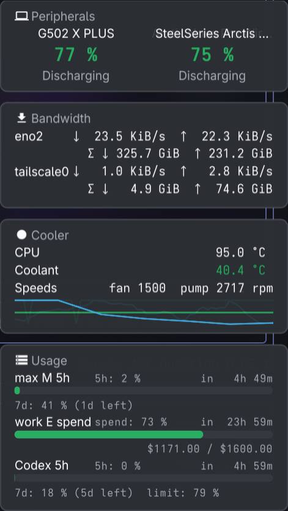

# 020 — devices through sanshoku

**Issue**: #81

## Status: COMPLETE

## Context

Specs 006, 008, 009, 015, 016, 017 and 018 built hayami's device access by
hand: HID++ over hidraw, Razer feature reports, SteelSeries reports, AAP over
L2CAP, BlueZ over D-Bus, hwmon by label, and two subprocesses the Python
monitor left behind, `liquidctl` for the cooler and `headsetcontrol` for the
Arctis. That code, with its measurements and rationale comments, is now
`github.com/ushineko/sanshoku` v0.1.0, one module hayami and hotaru share.
It was bench-tested on this desk, on the machine with the Mouse Dock Pro and
the Apex, and on the machine with the Unifying receiver.

Three things are better there than here. The Kraken is read directly, with
sanshoku's `docs/contention.md` recording what sharing its node with
hotaru's service and OpenRGB actually does (nothing is stolen; every reader
sees every other reader's replies, harmless for status). The Arctis Nova Pro
Wireless is read directly, off included. A Unifying receiver's child nodes
are asked at their own index, so the poll that took 19 s on that machine
takes 0.9 s.

This spec makes the peripherals and cooler sections read through sanshoku
and deletes `internal/peripherals` and `internal/cooler`. What the user sees
does not change, except where the old behaviour was a subprocess's: the
reasons a section gives for an empty card keep their words where the fact
is the same and gain one, "not permitted", for the udev rule that liquidctl
and OpenRazer used to install for us.

## Requirements

### R1. Dependency and packages

- R1.1 `go.mod` requires `github.com/ushineko/sanshoku v0.1.1` (v0.1.0 plus
  `ErrUnavailable`, for R3.7). The
  transitive `godbus/dbus/v5` was already a dependency; nothing else new.
- R1.2 `internal/peripherals` and `internal/cooler` are deleted, tests
  included. Nothing in `internal/` speaks to a device or runs `liquidctl`
  or `headsetcontrol` afterwards; `grep -r "liquidctl\|headsetcontrol"
  internal cmd` finds only the changelog and the reasons text in R3.
- R1.3 `HAYAMI_LIQUIDCTL_MATCH` is gone, and the README's mention of it.

### R2. The device set a section holds

Both sections keep the same shape (`panel.Source`, `Poll`, `Interval`,
`Section`, `Data`) and the same intervals (15 s peripherals, 5 s cooler).

- R2.1 A section holds a `devices` map from `Identity.Path` (with the
  driver name, since two drivers can name the same path family) to an open
  `sanshoku.Device`. Each poll: `sanshoku.Scan` over the section's drivers;
  a device whose candidate is no longer listed is closed and dropped; a new
  candidate is opened; every held device is read. That is hotplug by pull
  and it keeps the drivers' memory (a Logitech device's located indices, a
  Razer device's transaction ID, the Kraken's freshness) across polls.
- R2.2 A read that returns `sanshoku.ErrGone` closes and drops the device;
  it is re-found by the next scan if it is back.
- R2.3 Peripherals drivers: `logitech`, `razer`, `steelseries`, `apple`,
  `bluez`, in that order. Cooler drivers: `nzxt`; the processor is
  `hwmon.First(hwmon.Root, hwmon.CPU)` as before.
- R2.4 A section's constructor takes the scan function and the clock as
  the test seam: `NewPeripherals()` wires `sanshoku.Scan` over the real
  drivers; tests pass a scan that returns candidates whose `Open` yields
  fake devices implementing `battery.Source` (or `cooling.Source`). One
  fake device type per section test file, carrying only what the reasons
  need: readings, an open error, a read error, `ErrGone`, `ErrUnsupported`,
  a permission error, and for Logitech a `Presencer`.
- R2.5 `battery.Battery` maps to `view.PeripheralReading` where
  `peripherals.Battery` did: name, level, state, band, kind, cells. The
  `seen` map, `PeripheralsForget`, "since" and the dropped level on a state
  flip are unchanged.

### R3. Reasons

The card's reasons are the contract; the words below are the old ones
where the fact is the same.

- R3.1 Per driver, when it lists no candidate: "no Logitech receiver", "no
  Razer device", "no SteelSeries device", "no Bluetooth device with a
  battery" (bluez and apple together), and for the cooler "no cooler"
  (Info, replacing "no liquidctl").
- R3.2 A candidate whose `Open` fails with `sanshoku.IsPermission`: Warn,
  "<name> is not permitted", Detail "install the udev rule
  (60-sanshoku.rules) and replug; see the README". This is new: liquidctl's
  and OpenRazer's packages used to install the rule for us.
- R3.3 A candidate whose `Open` returns `ErrUnsupported`: present, Label
  the name, "unsupported", Detail as spec 017 had it. This replaces
  `steelseries.Unsupported()`.
- R3.4 An `Open` or read error of any other kind: Warn, "a <vendor> device
  would not answer" with the error as Detail; for the cooler "the cooler
  would not answer" (replacing "liquidctl failed").
- R3.5 Logitech presence: a receiver whose devices all answered nothing
  gives "a Logitech receiver, with nothing awake on it" with the quiet
  count, and one with nothing paired "a Logitech receiver, with nothing
  paired to it", from `logitech.Presencer` summed over the receiver's
  devices. The "speaks HID++ 1.0 … not read" line is gone: sanshoku reads
  the register (hayami spec 018 did too; keep whichever line spec 018 left
  reachable, and delete it if none is). `Quiet` is summed over receiver
  nodes only: a node whose `Identity.Phys` satisfies `hidraw.PairedChild` is
  one device the receiver's node already asked, and its quiet is not counted
  again.
- R3.6 Headsets: the "headsetcontrol …" reasons are gone. The Arctis is a
  SteelSeries device; off, it is a reading with no level and the card
  shows it as it showed `BATTERY_UNAVAILABLE`. A headset that only
  headsetcontrol knew is no longer read, and the changelog says so.
- R3.7 Bluetooth: a bluez or apple scan error that `errors.Is`
  `sanshoku.ErrUnavailable` (which `bluez.ErrNoBlueZ` wraps from sanshoku
  v0.1.1) gives "no Bluetooth adapter", Info, as before.
- R3.8 The cooler's "CPU: no sensor" reason lists every sensor looked for,
  from `hwmon.CPU`, as before.
- R3.9 A vendor whose candidates are listed, opened and read without error,
  and which returned no battery, gives "a <vendor> device answered nothing",
  Info: Razer and SteelSeries. Logitech has its presence line (R3.5);
  Bluetooth lists a device only when it has a level and keeps "no Bluetooth
  device with a battery" for nothing listed. A vendor whose only candidates
  were not read (unsupported, not permitted) has said why and does not also
  say this.

### R4. Doctor and CLI

- R4.1 `hayami-tui doctor` reports the reasons above per section, so a
  permission problem reads "install the udev rule" rather than "absent".
- R4.2 `hayami-tui readings` is unchanged in shape.

### R5. Packaging and docs

- R5.1 `packaging/60-sanshoku.rules` is a copy of sanshoku's, with a header
  saying where it comes from. `install.sh` installs it to
  `/etc/udev/rules.d/` when run with the privilege to, and otherwise prints
  the one `sudo install` line and the `udevadm control --reload` that
  follows, and does not fail. `uninstall.sh` mirrors it.
- R5.2 README: the "Reads" table's Peripherals and Cooler rows name
  sanshoku and the direct protocols; the "Where it comes from" section
  says the device code moved and links the module; a udev paragraph under
  Install; the changelog entry under Unreleased names what is breaking
  (liquidctl and headsetcontrol no longer used, `HAYAMI_LIQUIDCTL_MATCH`
  gone, headsets other than the Arctis no longer read).
- R5.3 `.claude/CLAUDE.md`: the sibling-project line about hotaru "for
  reading sensors" points at sanshoku instead.

### R6. Tests

- R6.1 The panel tests that drove the readers through function fields are
  rewritten onto the scan seam (R2.4). Every reason in R3 has one test.
  The protocol tests go with the packages; sanshoku holds them.
- R6.2 `doctor_test.go` follows.
- R6.3 `make test` opens no device. There are no live tests here; the
  bench in sanshoku is the hardware oracle.

## Acceptance Criteria

- [x] `make test`, `make lint` and `make build` pass; `CGO_ENABLED=0 go
  build ./cmd/hayami-tui` passes.
- [x] `internal/peripherals` and `internal/cooler` do not exist; no
  `liquidctl` or `headsetcontrol` subprocess remains.
- [x] Every reason in R3 has a passing test on the scan seam, and the
  permission reason names the udev rule.
- [x] `hayami-tui doctor` on this desk shows the G502, the Arctis, the Sony
  headset, the Kraken's coolant, pump and fan, and the processor, with
  hotaru's service running. Output pasted below: the Sony and the Arctis
  were not on at the same time, so one run shows each; every other device
  appears in both.
- [x] `hayami-tui readings` on the Unifying machine shows the K800 and the
  Basilisk Ultimate and completes in under 2 s (devices awake). 1.46 s;
  output pasted below.
- [x] The desktop panel is launched and photographed with the peripherals
  and cooler cards showing the same devices (the window you launched, by
  PID, closed afterwards). `docs/img/spec-020-panel.png`, 2026-09-30: G502
  77% and the Arctis 75% on Peripherals; CPU, coolant 40.4 °C, fan and pump
  on Cooler, beside the user's own panel, which was left running.
- [x] `install.sh` on a machine without the rule prints the sudo line and
  exits 0; with the rule present says nothing.
- [x] README, CLAUDE.md and changelog updated in the same commit; spec
  reconciled.

## Risks & Assumptions

- **Two processes on the Kraken's node** (hotaru's service and the panel)
  is the normal case now. sanshoku's contention page says it is safe for
  status; the doctor run with hotaru up is the check here.
- **The udev rule is nobody's job on a machine that never had liquidctl or
  OpenRazer.** R5.1 makes the installer say so; it cannot do it without
  root, and does not try to become root.
- **Headsets other than the Arctis lose their reading.** headsetcontrol
  knew many; sanshoku knows one. By the direct-access rule another headset
  gets a sanshoku driver when there is one on a desk to measure.
- **Rollback**: revert the merge; the old packages come back with it. No
  data or settings change.

## Alternatives Considered

- Open and close every device on every poll, as the old readers did:
  rejected; the drivers remember things worth keeping and the scan is the
  cheap part.
- Keep headsetcontrol beside sanshoku for other headsets: rejected; the
  rule is direct access, and nothing on any of the three desks needs it.

## Verification

### Checks

`make test` (race detector), `make lint` (0 issues), `make build` and
`CGO_ENABLED=0 go build ./cmd/hayami-tui` pass. `go.mod` gains one direct
requirement, `github.com/ushineko/sanshoku v0.1.0`; `golang.org/x/sys` moves
from direct to indirect and nothing else changes.

`make test` opens no device: the whole run under `strace -f -e
trace=openat,socket,connect` opened no `/dev/hidraw*`, no `/dev/bus/usb`, no
Bluetooth socket and not the system bus. It reads `/sys/class/hwmon` (a
temperature file, read-only, as before). Three tests used to poll the real
sources against the real machine and now take the desk away through
`hidraw.SysRoot` and `hidraw.DevRoot`: doctor's `bare`, the CLI's `run` (a
settings file that does not parse falls back to every section), and the
parity test's terminal-panel poll.

R3 on the scan seam (`internal/panel/peripherals_test.go`,
`internal/panel/cooler_test.go`):

| Reason | Test |
|---|---|
| R3.1 per vendor | `TestPeripheralsNamesEachVendorThatFoundNothing`, `TestACoolerWithNoLiquidDrawsTheProcessorAndSaysWhy` |
| R3.2 not permitted | `TestADeviceThatMayNotBeOpenedNamesTheUdevRule`, `TestACoolerThatMayNotBeOpenedNamesTheUdevRule`; through the real drivers and a written hidraw tree, `TestDoctorSaysInstallTheUdevRuleForADeviceThatMayNotBeOpened` |
| R3.3 unsupported | `TestAnUnsupportedDeviceIsNamedEvenWhenOthersAreDrawing`, `TestAnUnsupportedDeviceStepsAsideWhenTwoOthersAreDrawing`, `TestAnUnsupportedCoolerIsNamed` |
| R3.4 would not answer | `TestAnOpenThatFailsIsAVendorThatWouldNotAnswer`, `TestAReadThatFailsIsMarkedAndItsPartialAnswerKept`, `TestADriverThatFailsToListIsAVendorThatWouldNotAnswer`, `TestACoolerThatWouldNotAnswerIsMarkedAndKeepsItsError`, `TestACoolerDriverThatFailsToListWouldNotAnswer` |
| R3.5 receiver presence | `TestTheReceiverSaysWhichOfTheseItIs`, `TestQuietIndicesAreSummedAcrossReceivers`, `TestAChildNodesQuietIsNotCountedTwice`, `TestAQuietSlotIsCountedAndNeverNamed` |
| R3.6 Arctis off | `TestAnArctisSwitchedOffKeepsItsLastLevel`, `TestADeviceThatHasNeverGivenALevelIsNotDrawn` |
| R3.7 no adapter | `TestNoBluezIsNoBluetoothAdapter` (the scan error as `sanshoku.Scan` returns it: `bluez: ` + `ErrNoBlueZ`, wrapping `ErrUnavailable`) |
| R3.8 CPU sensors | `TestAProcessorWithNoSensorNamesEverySensorLookedFor` |
| R3.9 answered nothing | `TestAVendorThatAnsweredNothingSaysSo`, `TestAnsweredNothingIsOnlyForADeviceThatWasAsked` |

R2.1 and R2.2: `TestADeviceIsOpenedOnceAndHeldAcrossPolls`,
`TestADeviceNoLongerListedIsClosedAndReopenedWhenBack`,
`TestADeviceThatHasGoneIsClosedAndFoundAgain`, and the cooler's three.
Falsified: with the held map bypassed and `IsPermission` disabled, six of
them fail; with `ErrUnavailable`, the child-node rule and R3.9 each broken,
their three tests fail.

Installer (`tests/structure/installer_test.go`):
`TestTheInstallerPrintsTheUdevCommandsWhenItMayNotInstall`,
`TestTheInstallerInstallsTheUdevRuleWhenItMay`,
`TestTheInstallerSaysNothingWhenTheRuleIsThere` (this copy, and sanshoku's
rules under other comments), `TestTheUninstallerMirrorsTheUdevRule`.
`./install.sh --dry-run` on this desk, which has no `60-sanshoku.rules`,
prints the `sudo install -m644 …/packaging/60-sanshoku.rules
/etc/udev/rules.d/60-sanshoku.rules` and `sudo udevadm control --reload`
lines and exits 0.

### Doctor on this desk

hotaru's service (`hotaru serve`) and `hotaru-gui` running throughout. The
usage line is omitted.

```
bandwidth     ok      eno2 ↓ -- ↑ --, tailscale0 ↓ -- ↑ --
cooler        ok      CPU 95.0 °C, Coolant 40.8 °C, Speeds fan 1428 pump 2706 rpm
peripherals   ok      G502 X PLUS 77%, WH-1000XM6 81%
 doctor  0.01s user 0.01s system 10% cpu 0.145 total
```

The Arctis Nova Pro Wireless is not on the card because the headset was
switched off: its base station answered and said so. sanshoku's bench on the
same node, and headsetcontrol, agree:

```
steelseries  SteelSeries Arctis Nova Pro Wireless (1038:12e5)  /dev/hidraw14  [tested]
  battery: SteelSeries Arctis Nova Pro Wireless  no level  off  headset (13.5 ms)

Battery:
	Status: BATTERY_UNAVAILABLE
Error: [battery] Device is offline or not responding
```

A later run of the final build (after a refactor of the open-failure
classification, no change in behaviour) had the Sony headset disconnected:

```
cooler        ok      CPU 79.0 °C, Coolant 40.7 °C, Speeds fan 1428 pump 2706 rpm
peripherals   ok      G502 X PLUS 77%
```

The final build, hotaru's service still running, with the Arctis switched on
and the Sony headset disconnected:

```
cooler        ok      CPU 90.0 °C, Coolant 40.4 °C, Speeds fan 1428 pump 2714 rpm
peripherals   ok      G502 X PLUS 77%, SteelSeries Arctis Nova Pro Wireless 75%
```

### Readings on the Unifying machine

The static `hayami-tui`, copied over and run at night with the devices
asleep:

```
{
  "peripherals": {
    "data": {
      "Devices": null
    },
    "reasons": [
      {
        "text": "a Logitech receiver, with nothing awake on it",
        "detail": "8 indices asked and none answered; a sleeping device and an empty slot say the same thing",
        "status": "info"
      },
      {
        "text": "no SteelSeries device",
        "status": "info"
      },
      {
        "text": "no Bluetooth device with a battery",
        "status": "info"
      }
    ]
  }
}
/tmp/hayami-tui readings --sections peripherals  0.01s user 0.01s system 2% cpu 0.763 total
```

0.76 s with the devices asleep. Its "8 indices" was the double count R3.5
now excludes.

The final build (sanshoku with `ErrUnavailable`, R3.9, the child-node rule),
run again a few minutes later with the devices awake:

```
{
  "peripherals": {
    "data": {
      "Devices": [
        {
          "Name": "Razer Basilisk Ultimate Dongle",
          "Level": 62,
          ...
          "Kind": 1,
          ...
        },
        {
          "Name": "Logitech K800",
          "Level": 0,
          "Band": "Good",
          "Segments": 3,
          ...
        }
      ]
    }
  }
}
/tmp/hayami-tui readings --sections peripherals  0.01s user 0.01s system 1% cpu 1.461 total
```

and `doctor` there: `peripherals   ok      Razer Basilisk Ultimate Dongle 62%,
Logitech K800 ▮▮▮▯`. The Razer "answered nothing" line (R3.9) did not appear
because the Basilisk answered; it is covered by its tests.

### Photograph

Not taken; it is the reviewer's criterion.

### Gaps found

- Resolved during review: R3.7 was unreachable with sanshoku v0.1.0, whose
  `Scan` dropped `ErrNoBlueZ` as an absence (sanshoku PR #18 adds
  `ErrUnavailable`); a vendor listed and reading nothing gave no line (now
  R3.9); `Presence.Quiet` counted a paired child's device twice (now in
  R3.5).
- **The Arctis's label changes** from headsetcontrol's "Arctis Nova Pro
  Wireless" to the kernel's "SteelSeries Arctis Nova Pro Wireless". Noted in
  the changelog; not shortened here.

### The photograph



The Arctis's kernel name, "SteelSeries Arctis Nova Pro Wireless", truncates
as a card title where headsetcontrol's "Arctis Nova Pro Wireless" did not.
That is the card's title width (issue #37), not this spec; a leading vendor
word could be dropped for the label in a later change.
