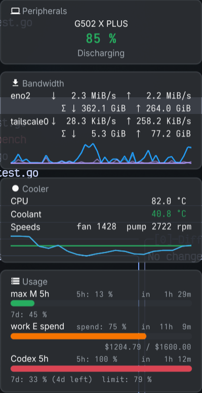

# 021 — the bandwidth trend

**Issue**: #87

## Status: COMPLETE

## Context

The cooler card has plotted its trend since spec 006 in the pane and since
spec 012 in the window: a `view.Trail` per series, drawn by the pane as a
labelled line of block characters and by the window as the design system's
sparkline. The bandwidth card shows two rates per interface and no trend,
and a rate is the reading a trend says the most about.

A bandwidth plot is not the cooler's plot. The cooler scales each series to
its own range, so coolant and processor are both readable on one line. On a
bandwidth card that would draw a 1 KiB/s interface with the amplitude of a
20 MiB/s one, and an interface's down and up could not be compared. Every
series shares one scale: zero at the bottom, the greatest sample in the
window at the top. fynedesygn spec 047 gives the window's sparkline that
scale and gives series colours; this spec gives the pane the same scale and
wires both.

## Requirements

### R1. Samples

- R1.1 `core.BandwidthSection` keeps the last `BandwidthTrail` samples of
  the receive and transmit rate for every configured interface, oldest
  first, in bytes per second as `Rates` reports them. `BandwidthTrail` is
  60: at `BandwidthInterval` (2 s) that is two minutes, the cooler's
  window at its own cadence.
- R1.2 A poll that read nothing for an interface records nothing for it (a
  gap compresses, as the cooler's does). An interface that leaves the
  configured set loses its samples.

### R2. The view

- R2.1 `view.Bandwidth` emits, after the rows, one `Trail` per displayed
  interface per direction, in interface order, down before up: `Name` is
  the interface and the arrow ("eno2 ↓", "eno2 ↑"), `Samples` the rates,
  `Status` `Info`. Two new fields on `view.Trail`: `Series int`, the
  interface's ordinal, and `Secondary bool`, true for the up trail, so a
  shell can colour a pair as a pair.
- R2.2 `view.Section` gains `TrailScale`, `ScaleEach` (zero value; the
  cooler) or `ScaleShared`. `view.Bandwidth` sets `ScaleShared`.
- R2.3 `view.SparklineIn(series []float64, width int, low, span float64)
  string` draws against a given range; `Sparkline` keeps its own-range
  behaviour and calls it. `arrange.go` computes the shared range for a
  section under `ScaleShared` (zero, the greatest sample across its trails,
  widened to `SparkMinSpan` when below it) and draws every trail with it.
  The pane's labelled stacked lines are otherwise as they are.

### R3. The window

- R3.1 A card whose section has trails gets a sparkline, as now; when the
  section's `TrailScale` is `ScaleShared` the card calls
  `Sparkline.SetScale(glance.ScaleShared)`.
- R3.2 A trail's colour: as now from its status, except a trail with a
  `Series` on a section under `ScaleShared` takes
  `glance.SeriesColour(theme, Series)`, and `glance.Faded` of it when
  `Secondary`. A section whose source is gone still dims every trail.
- R3.3 `SparkCapacity` covers the bandwidth window (60 is the cooler's
  too; keep one constant if they agree).

### R4. Dependency and docs

- R4.1 `go.mod` requires fynedesygn at the tag that carries spec 047
  (v0.1.75; v0.1.74 was tagged before 047 merged). Nothing else new.
- R4.2 README: the "What it does" bandwidth row mentions the trend; the
  changelog under `### Unreleased`. The pane's `--arrangement row` gains
  the bandwidth trail lines like the cooler's; `docs/` screenshots that
  show the bandwidth card are refreshed if any exist.

### R5. Tests

- R5.1 `core`: after N polls the trail holds min(N, 60) samples per
  direction; an unread interface adds nothing; a removed interface is
  forgotten.
- R5.2 `view`: `Bandwidth` with two interfaces yields four trails in the
  right order with the right names, `Series` and `Secondary`; `SparklineIn`
  with a shared range draws a 1-peak series flat beside a 100-peak one;
  `Sparkline` (own range) is unchanged.
- R5.3 `gui`: the bandwidth card's sparkline exists, has the four series,
  and is under the shared scale (through whatever `glance` exposes; the
  existing cooler sparkline test is the model).
- R5.4 The parity test still passes: both shells draw the trend.

## Acceptance Criteria

- [x] `make test`, `make lint`, `make build` and the cgo-free `hayami-tui`
  build pass.
- [x] The core, view and gui tests in R5 pass.
- [x] `hayami-tui --sections bandwidth --arrangement row` on this desk shows
  a labelled trail line per interface per direction under one scale
  (pasted below, and photographed with `tools/shot-tui.sh`).
- [x] The desktop panel is launched and photographed with the bandwidth
  card's sparkline showing both interfaces (the window you launched, by
  PID, closed afterwards), and the plot reads as one scale: the quieter
  interface is visibly the flatter line. * *
  `docs/img/spec-021-panel.png`, 2026-09-30, beside the user's own panel:
  eno2 in link blue with its upload faded, tailscale0 in violet flat along
  the floor, one scale.
- [ ] README and changelog in the same commit; spec reconciled.

## Risks & Assumptions

- **A quiet interface is a flat line by design.** That is the point of the
  shared scale; a reader who wants each interface's own shape has the
  cooler's kind of plot, and this spec does not offer a switch.
- **A burst dominates the window for two minutes.** The scale follows the
  peak in the window; when the burst leaves the window the scale drops.
  This is what "the greatest peak in its window" asks for.
- **Rollback**: revert; no data changes.

## Gaps found

- **fynedesygn v0.1.74 did not carry spec 047**: it was tagged before the
  merge. v0.1.75 carries it, with `Sparkline.Scale()` added so R5.3 asserts
  the plot's scale without measuring pixels. Closed.

## Verification

Window (R3, R5.3), headless: the bandwidth card's plot holds the four traces
and reports `glance.ScaleShared`; the cooler's reports `glance.ScaleEach`; a
bandwidth trace is `glance.SeriesColour(theme, Series)`, the up trace
`glance.Faded` of it, a cooler trace keeps its status colour and a gone
section is dim under either scale; `SparkCapacity` equals both
`core.BandwidthTrail` and `panel.CoolerTrail`. Each was broken on purpose
and failed before being put back.

`make test` (headless, `-race`): every package ok. `make lint`: 0 issues.
`make build` and `CGO_ENABLED=0 go build ./cmd/hayami-tui`: pass.

`hayami-tui --sections bandwidth --arrangement row` on this desk, after about
forty seconds (100 columns):

```
eno2                                                                    ↓  49.8 KiB/s  ↑  75.8 KiB/s
tailscale0                                                              ↓   2.7 KiB/s  ↑  18.4 KiB/s
eno2 ↓       ▂▃▆▆▁▁▁▅▁▄▂▁▇▄▂▁▁
eno2 ↑       ▂▃▇▆▁▁▂▆▂▅▃▁█▄▁▂▂
tailscale0 ↓ ▁▁▁▁▁▁▁▁▁▁▁▁▁▁▁▁▁
tailscale0 ↑ ▁▁▄▄▁▁▁▄▁▄▁▁▆▃▁▁▁
```

One scale across the four lines: the tailscale down rate, a few KiB/s beside
eno2's tens, is the floor throughout. Photographed with `tools/shot-tui.sh`
(100×8, an opaque terminal): the same four labelled lines under the two rate
rows, the quiet interface's down line flat along the floor.

### The photograph


