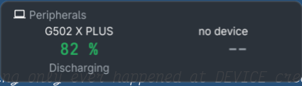
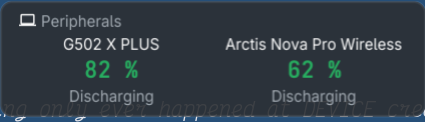
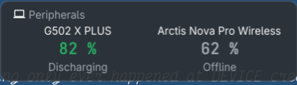

# 022 — two cells, always

**Issue**: #89

## Status: COMPLETE

## Context

The peripherals card draws `PeripheralSlots` (two) cells: the mouse first,
then the rest ordered live-before-quiet and most-recent-first
(`view.SelectPeripherals`, spec 017). A device that has gone quiet is kept
dim for `PeripheralsForget` (ten minutes) and then forgotten; a cell with
no device behind it is hidden (`gui.drawCells`). So a headset switched off
holds its cell for ten minutes, then the card collapses to one centred
cell, and reflows again when the headset comes back. The panel's rule is
that nothing transient reflows the interface.

Two changes. The card always draws both cells, so it never reflows. And
the right cell goes to the non-mouse device whose state changed most
recently, whether that change was connecting or disconnecting: a device
that disconnects keeps its slot, dim, with its last level, and a device
that connects after that takes the slot from it. Only a device that has
never been seen this session is nothing to draw, and then the cell holds
a placeholder rather than hiding.

## Requirements

- R1 `panel.Peripherals` keeps every device it has ever seen this session
  (the `seen` map no longer drops a device at `PeripheralsForget`; the
  reading is `Stale` after it, as now). A device that reports no level
  and no band on a state flip is still forgotten (spec 017's rule) but is
  remembered again the next time it answers.
- R2 `view.SelectPeripherals`: the left slot is the mouse, as now. The
  right slot is the non-mouse device with the most recent state change,
  live or quiet: recency is `Since` for a live device and `Seen` for a
  quiet one (the definitions `byLiveThenRecent` already has), compared
  without the live-before-quiet step. Kind, then name, breaks a tie, as
  before. A device that returns from quiet takes a new `Since`, so it can
  take the slot back (revised during implementation: the old reset only
  happened after a device was forgotten, which R1 stops). The others go to
  the overflow note as now.
- R3 `view.Peripherals` always emits `PeripheralSlots` cells. The slots
  fill from the devices there are, the mouse first, as now (a desk with no
  mouse puts its other device left rather than leaving half the card
  empty; revised during implementation). A slot with no device is a
  placeholder cell: `Label` "no mouse" when there are no devices at all,
  "no device" otherwise, `Value` `NoQuantity()`, `Stale` true, so it draws
  dim like a quiet device and the card keeps its shape. A placeholder is
  not a reason and does not appear in doctor.
- R4 `gui.drawCells` never hides a cell that the section emitted; with R3
  that is both cells always. The slack cells beyond the two stay hidden.
- R5 The pane draws the same two cells and the same placeholders.
- R6 README changelog under `### Unreleased`; `docs/` if a screenshot shows
  the card (spec 020's and 021's photographs stay as they are).

## Acceptance Criteria

- [x] `make test`, `make lint`, `make build` pass.
- [x] `view` tests: a mouse and a headset give mouse left, headset right;
  headset quiet and AirPods connected later give AirPods right; AirPods
  quiet after that with `Seen` newer than the headset's give AirPods right,
  dim; a mouse alone gives the "no device" placeholder right; no devices at
  all give both placeholders; three live devices give the overflow note.
- [x] `panel` test: a device quiet for longer than `PeripheralsForget` is
  still in the reading, `Stale`.
- [x] `gui` test: the card shows two cells with the headset quiet and with
  no second device at all, and the card's minimum height is the same in
  both cases (no reflow). Its width follows the longer name by a few pixels,
  which is the design system's cell sizing to its name up to a cap
  (fynedesygn #147); the window takes its width from the widest card, so
  it does not show on the panel. Quiet against live headset is the same
  size in both dimensions.
- [x] The desktop panel is launched with the headset off and photographed
  showing the mouse and the dim headset (or a placeholder), then the
  headset switched on by the user and photographed again, the card the
  same size (by PID, closed afterwards).
  Done 2026-09-30 beside the user's own panel, three states on one launched
  window, 283×482 in each: never seen (`docs/img/spec-022-never-seen.png`,
  the placeholder), switched on (`spec-022-on.png`, 62%), switched off again
  (`spec-022-off.png`, dim 62% "Offline"). The photographs are the
  peripherals card only; the full frames carry the desk's usage figures.
- [x] README and changelog in the same commit; spec reconciled.

## Risks & Assumptions

- **A device seen once is remembered for the session.** Memory is one
  reading per device; a desk does not have enough devices for that to
  matter.
- **A disconnected device can hold the slot over a connected one** only
  when it disconnected after the other connected; the reader's most recent
  change is what the slot shows. If that reads wrong on the desk, the
  live-before-quiet step comes back and the spec says so.
- **Rollback**: revert.

## Implementation notes

- **Without a mouse the slots fill from the rest, as before.** R2 says "the
  left slot is the mouse, as now", and now a desk with no mouse gives both
  slots to other devices. So "no mouse" appears only when there are no
  devices at all; a headset alone is the headset on the left and "no device"
  on the right. Reading R3 literally ("no mouse" whenever there is no mouse)
  would leave half the card empty on a mouse-less machine while a device sat
  in the overflow note.
- **`Since` is reset when a device comes back from quiet**, not only after it
  was forgotten. With nothing forgotten any more (R1), the old reset never
  fired, and a headset switched off and on kept its first arrival time and
  could not take the slot back. The consequence: a non-mouse device that
  idles for one poll and wakes (a Logitech keyboard behind a receiver) takes
  the right slot when it wakes. The mouse is unaffected -- it has the left
  slot regardless.
- **The tie-break is kind, then name**, as `byLiveThenRecent` had it (now
  `byRecentChange`); R2 says "name".
- **`PeripheralsForget` is removed**, not kept unused. The panel test ticks
  eleven minutes and then eight hours.
- **`view.Cell` gained `Placeholder`**, so doctor's summary can skip the
  empty slots (R3). The cache round-trips it.
- **Cache from 0.7.0**: a section cached with one cell is restored with one
  cell and gains the placeholder on the first poll; once per upgrade.

## Gaps found

- **A cell's width follows its name** (fynedesygn `glance.Cell`: the widest
  of the value, and the name and note up to `CellNameBudget`). The card with
  "no device" beside "G502 X PLUS" measured 134.9 px wide in the test theme
  against 147 with "Arctis Nova Pro Wireless" quiet beside it; the height
  was the same. The same was already true of one device replacing another
  (AirPods for the Arctis). The window is as wide as its widest card, and
  the peripherals card is not that on this panel, so it does not show; a
  cell grid that sized every cell to the budget would close it, and that is
  a library change.

## Verification

`make test`: every package `ok`.

`make lint`: `0 issues.` -- with a fresh `GOCACHE` and
`GOLANGCI_LINT_CACHE`. With the shared caches the linter reports eight
issues in files this change does not touch, at paths in *other* worktrees
(`../../fix-023-limit-amounts/internal/usage/entry.go` and the like), where
it cannot see their `//nolint` comments. An artefact of several worktrees
sharing the build cache, not of this change.

`make build` and `CGO_ENABLED=0 go build ./cmd/hayami-tui`: both build.

`./hayami-tui --sections peripherals --once`, the headset off and not seen
by this process:

```
 Peripherals
              G502 X PLUS                               no device
                 84 %                                      --
              Discharging
```

`./hayami-tui doctor`, the peripherals line -- the placeholder is not
reported:

```
peripherals   ok      G502 X PLUS 84%
```

Photographs: below.

### Found on the way

The first photograph run showed the panel never seeing the headset come on.
That was not this spec: sanshoku's `steelseries` driver read a held handle
oldest-first, and hidraw copies every program's replies to every handle, so
the reading froze at the state the headset had when the handle was opened
(sanshoku #24, fixed in v0.1.4, which this branch pins). And an off headset
answered with no level and was carried as a live reading; under this spec
it is dim, with `Seen` frozen at the moment it went off so a device that
connects later out-ranks it.

### The photographs




