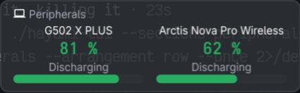

# 025 — a bar under a level

**Issue**: #95

## Status: COMPLETE

## Context

A peripheral's cell says its level as a number, `82 %`. The usage card's
meters say theirs as a bar, and a bar is what the eye compares across a
row. A reading that is a band of segments (`▮▮▮▯`, the K800 under spec
018) draws its level already and wants no bar under it.

fynedesygn spec 048 gives `glance.Cell` a bar row, reserved whether or not
a bar is shown, so the card's height does not move when a device gains or
loses a level. This spec uses it, and gives the pane the same line.

## Requirements

- R1 `go.mod` requires fynedesygn at the tag carrying spec 048 (v0.1.76 or
  later).
- R2 `view.Cell` gains `Bar float64` and `HasBar bool`. `view.Peripherals`
  sets them for a cell whose reading has a level (`HasLevel`): the
  fraction is the level over 100, and the status is the cell's. A cell
  whose reading is a band, or has no level, has no bar. A placeholder has
  none.
- R3 The window: `drawCells` calls `SetBar(cl.Bar, status)` for a cell with
  `HasBar` and `ClearBar()` otherwise; a dim cell's bar dims with it (the
  library does that).
- R4 The pane: under a level cell's value line, a bar line the cell's
  width in the meter's block characters (`BarFull`/`BarEmpty`), painted in
  the cell's status; a band cell's line is blank so the columns stay
  aligned. In `--arrangement row`, where a cell is one line, the bar is a
  short `[▮▮▮▯▯]`-style run after the level, only if it fits; the spec
  records which it did.
- R5 README changelog under `### Unreleased`.

## Acceptance Criteria

- [x] `make test`, `make lint`, `make build` and the cgo-free `hayami-tui`
  build pass.
- [x] `view` tests: a level cell has a bar of level/100 and the cell's
  status; a band cell and a placeholder have none.
- [x] `gui` test: the bar is set on the level cell and cleared on the band
  cell, through what `glance` exposes; the card's minimum height is the
  same with and without bars.
- [x] `hayami-tui --sections peripherals` on this desk shows the bar under
  the G502 and the Arctis (pasted).
  Run 2026-09-30 with the mouse awake and the headset on; output under
  "With the desk awake" below.
- [x] The desktop panel is launched and photographed with bars under the
  two cells (by PID, closed afterwards; committed, the card carries no
  personal figures).
  `docs/img/spec-025-cells.png`, 2026-09-30: G502 81% and the Arctis 62%,
  each with its bar.
- [x] README and changelog in the same commit; spec reconciled.

## Risks & Assumptions

- **The card grows by one row once** at upgrade, for the reserved bar row.
- **Rollback**: revert.

## Verification

Checks, in this worktree on fynedesygn v0.1.76 (no other dependency changed
in `go.mod` or `go.sum`):

- `make test` (headless, `-race`): every package `ok`.
- `make lint`: `0 issues.`
- `make build`: both binaries built; `CGO_ENABLED=0 go build ./cmd/hayami-tui`
  built.
- Falsified: with `SetBar` replaced by `ClearBar` the gui test fails ("the
  level cell drew no bar"); with the `ClearBar` branch removed it fails ("a
  cell that lost its level kept its bar"); with `HasBar` false in
  `peripheral()` or the pane's bar blanked, the view tests fail.

**The pane on this desk read no device.** The mouse was asleep and the
headset off for the whole session: `hayami-tui readings` polled every ten
seconds for two minutes returned `"Devices": null` each time. So the pane
shows the two placeholders, which have no bar, and the reserved fourth line
is blank under them:

```
$ hayami-tui --sections peripherals --once
Peripherals
a Logitech receiver, with nothing paired to it
no Razer device
no Bluetooth device with a battery
               no mouse                                 no device
                  --                                       --


$ hayami-tui --sections peripherals --arrangement row --once
a Logitech receiver, with nothing paired to it
no Razer device
no Bluetooth device with a battery
no mouse                                                                      --
no device                                                                     --
```

The same renderer on invented devices, width 80 (a level pair, then a level
beside a band), stack and row:

```
Peripherals
             Example Mouse                           Example Headset
                 76 %                                     47 %
              Discharging                              Discharging
━━━━━━━━━━━━━━━━━━━━━━━━━━━━━━─────────  ━━━━━━━━━━━━━━━━━━─────────────────────

Peripherals
             Example Mouse                          Example Keyboard
                 18 %                                     ▮▮▮▯
              Discharging                                 Good
━━━━━━━────────────────────────────────

Example Mouse  Discharging                                       76 % ━━━━━━━━──
Example Headset  Discharging                                     47 % ━━━━━─────

Example Mouse  Discharging                                       18 % ━━────────
Example Keyboard  Good                                           ▮▮▮▯
```

**Row arrangement: the bar follows the level.** A ten-character run of the
meter's glyphs (`━`/`─`, a tenth of the battery each), after the level, with
no brackets. A band cell's line carries eleven spaces in its place so the
readings end in one column down the pane. The meter's glyphs rather than
`▮▯`, because a band cell draws its level as `▮▮▮▯` and a level cell's bar
beside it must not read as a second band. Whether the bars are drawn is
decided for the whole pane: only when every cell's name, state and reading
fit beside a bar uncut; otherwise no line has one, and the name keeps its
room.

**The pane's bar line is always drawn**, blank when no cell on the line has a
bar, as the window's row is always reserved. A cell in the stack and grid
arrangements is now four lines, not three; `cell_test.go`'s line counts were
updated to say so.

**Spec correction:** R2 names `HasLevel`, which does not exist. A reading
has a level when it is not a band (`Segments == 0`), which is how
`peripheral()` already branches; the bar is set on that branch.

**A restored section from an older cache has no bar** until the first live
poll: the cached `view.Cell` has no `Bar`/`HasBar`, which decode as none.


### With the desk awake

```
$ hayami-tui --sections peripherals --arrangement row --once
 G502 X PLUS  Discharging                                         81 % ━━━━━━━━──
Arctis Nova Pro Wireless  Discharging                            62 % ━━━━━━────
```

The stacked pane's one-shot caught the mouse asleep again and drew the
Arctis with its bar beside a "no device" slot; the row run two seconds
later had both.


