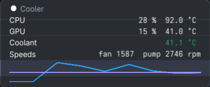

# 026 — the processors on one line

**Issue**: #96

## Status: COMPLETE

## Context

The cooler card says the processor's temperature and nothing about the
graphics card, and nothing about how busy either is. hotaru's window has
had both since its spec 001, from `/proc/stat` for the processor's load
and, for the graphics card, hwmon where the kernel has a driver (`amdgpu`,
`nouveau`) and `nvidia-smi` otherwise. This desk is the otherwise.

Two rows, each one line: `CPU  12 %  78 °C` and `GPU  4 %  41 °C`. The
graphics card's temperature joins the sparkline as a third trace.

## Requirements

### R1. Readings

- R1.1 `internal/core` (or a package beside it) reads the processor's load
  from `/proc/stat` as the busy fraction between two polls (hotaru's
  `readings.CPU`). The first poll, having no previous sample, takes two
  200 ms apart (`core.CPUWarmup`) and returns the load from them, so a
  command that polls once (`--once`, `doctor`, `readings`) says it. The
  path is injectable for tests.
- R1.2 Graphics temperature: `hwmon.First(hwmon.Root, hwmon.GPU)` from
  sanshoku; when no sensor is there, `nvidia-smi
  --query-gpu=temperature.gpu,utilization.gpu --format=csv,noheader,nounits`
  with a 2 s timeout, parsed as hotaru's `ParseSMI` does. Graphics load:
  `/sys/class/drm/card*/device/gpu_busy_percent` where it exists (AMD),
  else the same nvidia-smi call. nvidia-smi is the one subprocess the
  direct-access rule allows here, because NVML is a vendor library and not
  a kernel node; the code comment says so, and so does `.claude/CLAUDE.md`'s
  direct-access rule. Absent nvidia-smi, the GPU row is not drawn and
  doctor says "no GPU sensor" (an `Aside` reason: off the card, listed by
  doctor, and not counted toward "partial"). A card that answered and
  misses a poll keeps its last reading with its row dimmed (`Row.Stale`),
  that row only: the cooler's keep-and-dim `Gone` rule is the coolant's
  and the processor's, not the card's.
- R1.3 The cooler section keeps a trail of the graphics temperature as it
  keeps the processor's (`CoolerTrail` samples, averaged the same way).

### R2. The view

- R2.1 `view.CoolerReading` gains `CPULoad`, `HasCPULoad`, `GPU`,
  `HasGPU`, `GPULoad`, `HasGPULoad`, `GPUTrail`, and `GPUStale` for a
  reading kept from an earlier poll; `view.Row` gains `Stale`, which both
  shells draw dim.
- R2.2 The CPU row's value is load and temperature on one line, `12 %  78
  °C`; a load not yet known is left blank at the load's width. The GPU
  row the same, drawn only when there is a temperature. Units align as the Speeds row's
  do (`PadUnit`).
- R2.3 A third trail, `Name` "GPU", `Status` `Info`, when there are
  samples. The cooler stays `ScaleEach`. So the three trails can be told
  apart, `view.Trail` gains `Coloured bool` ("takes a series colour rather
  than a status colour"), and the window's `trailColour` draws a
  `Coloured` trail in `glance.SeriesColour(theme, Series)`, `Faded` when
  `Secondary`, after the dim case for a gone section, as now. Every
  bandwidth trail is `Coloured`; the cooler's CPU trail is `Coloured` with
  `Series` 0 (the link blue it has always been drawn in) and its GPU trail
  with `Series` 1 (violet); the coolant is not `Coloured` and keeps its
  band colour. The pane labels its stacked lines as now.

### R3. Doctor and docs

- R3.1 Doctor's cooler summary includes the loads and the GPU. A section
  whose only reasons are `Aside` is "ok", not "partial"; doctor still lists
  those reasons.
- R3.2 README "What it does" cooler row; changelog under `### Unreleased`.

## Acceptance Criteria

- [x] `make test`, `make lint`, `make build` and the cgo-free `hayami-tui`
  build pass.
- [x] `core` tests: load from two fake `/proc/stat` samples; `ParseSMI` on
  a captured line and on garbage; the AMD busy file; a missing sensor and
  a missing nvidia-smi give no GPU without an error.
- [x] `view` tests: the two rows' text with and without load, the GPU row
  absent without a temperature, three trails with the right names, series
  and `Coloured`; a stale GPU row alone is `Stale`.
- [x] `panel` test: a card that misses a poll dims only its own row; the
  section is not `Gone`, the CPU and coolant rows are live.
- [x] `doctor` test: a cooler whose only reason is an `Aside` "no GPU
  sensor" is "ok" and the report lists the reason.
- [x] `hayami-tui --sections cooler` on this desk shows both rows and three
  trail lines (pasted).
- [x] The desktop panel is launched and photographed with both rows and the
  three-trace sparkline (by PID, closed afterwards; committed, the cooler
  card carries no personal figures).
  `docs/img/spec-026-cooler.png`, 2026-09-30: `CPU 28 % 92.0 °C`, `GPU 15 %
  41.0 °C`, coolant and speeds, three traces in blue, violet and green.
- [x] README and changelog in the same commit; spec reconciled.
  changelog written in the working tree; the commit is the reviewer's.*

## Risks & Assumptions

- **nvidia-smi every 5 s** is a subprocess a poll; hotaru has run it at
  that cadence for months. If it costs, the spec records it and the GPU
  poll slows to every other cooler poll.
- **Rollback**: revert.

## Verification

Outputs and the photograph go here.

Checks, on the implementing worktree, after the review's five follow-ups:

```
$ make test          # go test -race ./...  -- every package ok
$ make lint          # 0 issues.
$ make build         # hayami and hayami-tui built
$ CGO_ENABLED=0 go build ./cmd/hayami-tui    # ok
```

`./hayami-tui --sections cooler --once` on this desk (NVIDIA card on the
proprietary driver, so the GPU row comes from nvidia-smi). The processor's
load is there on the one poll, from two samples 200 ms apart; the processor
was busy with the build that had just run.

```
 Cooler
CPU                                                               35 % 100.0 °C
GPU                                                               12 %  40.0 °C
Coolant                                                                 41.1 °C
Speeds                                                   fan 1507  pump 2730 rpm
▄
▄
▄
```

In `row` the three trail lines carry their names (`Coolant`, `CPU`, `GPU`).

`./hayami-tui doctor | grep cooler`:

```
cooler        ok      CPU 27 % 100.0 °C, GPU 16 % 40.0 °C, Coolant 41.1 °C, Speeds fan 1500 pump 2730 rpm
```


### The photograph


